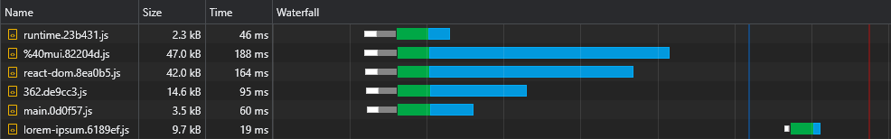

# Client-side Rendering

This project is a case study of CSR, it aims to explore the potential of client-side rendered apps in comparison to server-side rendering.

## Motivation

In the recent years, Server-side rendering frameworks such as Next.jsand Remix started to gain popularity in an increasing pace.
While SSR has it's own set of perks, those frameworks are braging about how fast they are ("Performance as a default"), implying Client-side rendering is slow.
In addition, it is a common perception that great SEO can only be achieved by using those SSR frameworks, and that CSR apps will give worse results.

This project implements CSR best practices with some tricks that can make it infinitely scalable.
The idea is to simulate a production grade app in terms of number of packages used and see how fast it can load.

It is important to note that acheiving load speed should not come on behalf of developer experience, so the way this project is architected should vary only slightly compared to "normal" react apps.

This case study will cover two major aspects: SEO and performance. It will try to inspect how we can achieve great scores in either of them, both compared to SSR and on their own.

Note: while this project is implemented using React, the majority of it's tweaks are not tied to any framework and are purely browser-based.

## Performance

### Bundle Size

The first rule of thumb is to use as fewer dependencies as possible, and among those, to select the ones with smaller size.

For example:

Use [date-fns](https://www.npmjs.com/package/date-fns) instead of [moment](https://www.npmjs.com/package/moment)
<br>
Use [zustand](https://www.npmjs.com/package/zustand) instead of [redux](https://www.npmjs.com/package/redux)
<br>
Etc...

This is crucial not only for CSR apps, but also for SSR and SSG ones, since the bigger your bundle is - the longer it will take the page to be interactive (either through hydration or regular rendering).

### Caching

Ideally, every hashed file should be cached, and `index.html` should **NEVER** be cached.
It means that the browser would initially cache `main.[hash].js` and would have to redownload it only if its hash (content) changes.

However, since `main.js` includes the entire bundle, the slightest change in code would cause its cache to expire, meaning the browser would have to download it again.
Now, what part of our bundle comprises most of its weight? The answer is the **dependencies**, also called **vendors**.

So if we could split the vendors to their own hashed chunk, that would allow a separation between our code and the vendors code, leading to less cache invalidations:

```
optimization: {
  runtimeChunk: 'single',
  splitChunks: {
    chunks: 'initial',
    cacheGroups: {
      vendor: {
        test: /[\\/]node_modules[\\/]/,
        name: 'vendors'
      }
    }
  }
}
```

That will create a `vendors.[hash].js` file.

Although this is a substantial improvement, what would happen if we updated a very small dependency?
In such case, the entire vendors chunk's cache will invalidate.

So, in order to make this even better, we will split **each dependency** to its own hashed chunk:

```
name: ({ context }) => (context.match(/[\\/]node_modules[\\/](.*?)([\\/]|$)/) || [])[1]
```

That will create files like `react-dom.[hash].js`, `react-router-dom.[hash].js` etc.

More info about the default configurations (such as the split threshold size) can be found here:
<br>
https://webpack.js.org/plugins/split-chunks-plugin/#defaults

### Code Splitting

A lot of the features we write end up being used only in a few of our pages, so we would like them to be downloaded only when the user visits the page they are being used in.

For Example, we wouldn't want users to download the [react-big-calendar](https://www.npmjs.com/package/react-big-calendar) package if they just tried to get to the home page. We would only want that to happen when they visit the calendar page.

The way we achieve this is (preferably) by route-based code splitting:

```
const Home = lazy(() => import(/* webpackChunkName: "index" */ 'pages/Home'))
const LoremIpsum = lazy(() => import(/* webpackChunkName: "lorem-ipsum" */ 'pages/LoremIpsum'))
const Pokemon = lazy(() => import(/* webpackChunkName: "pokemon" */ 'pages/Pokemon'))
```

So when the user visits the LoremIpsum page, they only download the main chunk script (which includes all shared dependencies such as the framework) and the lorem-ipsum chunk.

Note: I believe that it is completely fine (and even encouraged) to have the user download your entire site (so they can have a smooth _app-like_ navigation experience). But it is **VERY** wrong to have all the assets being downloaded **initially**, delaying the first render of the page.
<br>
These assets should be downloaded **after** the user-requested page has finished rendering and is visible to the user.

### Preloading Async Chunks

Code splitting has one major flaw - the runtime doesn't know these async chunks are needed until the main script executes, leading to them being fetched in a significant delay:



The way we can solve this issue is by generating multiple html files (one for each pages) and preloading the relevant assets:

```
plugins: [
  ...pagesManifest.map(
    ({ name }) =>
      new HtmlPlugin({
        filename: `${name}.html`,
        scriptLoading: 'module',
        templateContent: ({ compilation }) => {
          const assets = compilation.getAssets().map(({ name }) => name)
          const script = assets.find(assetName => assetName.includes(`/${name}.`) && assetName.endsWith('.js'))

          return htmlTemplate(script)
        }
      })
  ),
]
```

```
module.exports = script => `
  <!DOCTYPE html>
  <html lang="en">
    <head>
      <title>CSR</title>
    </head>
    <body>
      <link rel="preload" href="${script}" as="script"></link>

      <div id="root"></div>
    </body>
  </html>
`
```

_Please note that other types of assets can be preloaded the same way (like stylesheets)._
<br>
<br>
This way, the browser is able to fetch the page-related script **in parallel** with render-critical assets:


