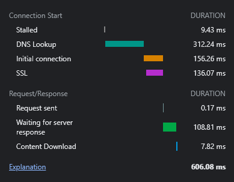
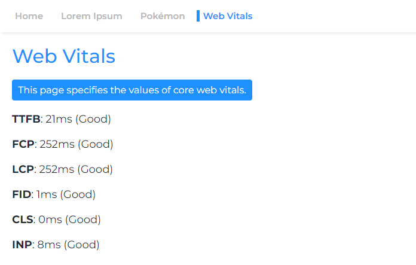

<h1 align="center">Client-side Rendering</h1>

This project is a case study of CSR, it explores the potential of client-side rendered apps compared to server-side rendering.

To use this project as a production-ready boilerplate, refer to the _[BOILTERPLATE.md](BOILERPLATE.md)_ instruction file.

### Legend

**CSR**: Client-side Rendering
<br>
**SSR**: Server-side Rendering
<br>
**SSG**: Static Site Generation

An in-depth comparison of all rendering methods can be found on this project's _Comparison_ page: https://client-side-rendering.pages.dev/comparison

## Table of Contents

- [Intro](#intro)
- [Motivation](#motivation)
- [Performance](#performance)
  - [Bundle Size](#bundle-size)
  - [Caching](#caching)
  - [Code Splitting](#code-splitting)
  - [Preloading Async Pages](#preloading-async-pages)
  - [Splitting Async Vendors](#splitting-async-vendors)
  - [Preloading Data](#preloading-data)
  - [Prefetching Async Pages](#prefetching-async-pages)
  - [Accelerating Unchanged Pages](#accelerating-unchanged-pages)
  - [Tweaking Further](#tweaking-further)
    - [Preventing Incremental Rendering](#preventing-incremental-rendering)
    - [Transitioning Async Pages](#transitioning-async-pages)
    - [Preloading Other Pages Data](#preloading-other-pages-data)
    - [Revalidating Active Apps](#revalidating-active-apps)
    - [Generating Static Data](#generating-static-data)
  - [Interim Summary](#interim-summary)
  - [The Biggest Drawback of SSR](#the-biggest-drawback-of-ssr)
  - [The SWR Approach](#the-swr-approach)
    - [Implementing SWR](#implementing-swr)
  - [Summary](#summary)
  - [Deploying](#deploying)
  - [Benchmark](#benchmark)
  - [Areas for Improvement](#areas-for-improvement)
- [SEO](#seo)
  - [Indexing](#indexing)
    - [Google](#google)
    - [Prerendering](#prerendering)
  - [Social Media Share Previews](#social-media-share-previews)
  - [Sitemaps](#sitemaps)
- [CSR vs. SSR](#csr-vs-ssr)
  - [SSR Disadvantages](#ssr-disadvantages)
  - [Why Not SSG?](#why-not-ssg)
  - [The Cost of Hydration](#the-cost-of-hydration)
- [Conclusion](#conclusion)
  - [What Might Change in the Future](#what-might-change-in-the-future)

# Intro

**Client-side rendering** is the practice of sending the web browser static assets and leaving it to perform the entire rendering process of the app.
<br>
**Server-side rendering** is the practice of rendering the entire app (or page) on the server, sending to the browser a pre-rendered HTML document ready to be displayed.
<br>
**Static Site Generation** is the practice of pre-generating HTML pages as static assets to be sent and displayed by the browser.

Contrary to popular belief, the SSR process of modern frameworks such as React, Angular, Vue and Svelte, makes the app render twice: one time on the server and another time on the browser (this is called "hydration"). Without the latter, the app will not be interactive and would just act as a "lifeless" web page.
<br>
The hydration process doesn't seem to be any faster than a normal render (excluding the painting procedure of course).
<br>
Needless to say that SSG apps have to be "hydrated" aswell.

The HTML document is fully constucted in both SSR and SSG, which gives them the following advantages:

1. Web crawlers will be able to crawl their pages out-of-the-box, which is critical for SEO.
2. The _[FCP](https://web.dev/fcp)_ of the page is usually very good (in SSR it heavily depends on the API server response times).

On the other hand, CSR apps have the following advantages:

1. The app itself is completely decoupled from the server, which means it loads without being affected by the API server's response times, allowing for seemless page transitions.
2. The developer experience is seemless, there is no need to pay attention to which pieces of code will run on the server and which will run in the browser.

In this case-study, we will focus on CSR and how to overcome its (seemingly) inherent shortages while leaveraging its strong points.

Each optimization will be included in the deployed app that can be found here: https://client-side-rendering.pages.dev

# Motivation

_"Recently, SSR (Server Side Rendering) has taken the JavaScript front-end world by storm. The fact that you can now render your sites and apps on the server before sending them to your clients is an absolutely **revolutionary** idea (and totally not what everyone was doing before JS client-side apps got popular in the first place...)._

_However, the same criticisms that were valid for PHP, ASP, JSP, (and such) sites are valid for server-side rendering today. It's slow, breaks fairly easily, and is difficult to implement properly._

_Thing is, despite what everyone might be telling you, you probably don't need SSR. You can get almost all the advantages of it (without the disadvantages) by using prerendering."_

_~[Prerender SPA Plugin](https://github.com/chrisvfritz/prerender-spa-plugin#what-is-prerendering)_

Over the last few years, server-side rendering has started to (re)gain popularity in the form of frameworks such as _[Next.js](https://nextjs.org)_ and _[Remix](https://remix.run)_ to the point that developers just start working with them as a default, without understanding their limitations and even in apps which do not require SEO at all (like those who have a login requirement).
<br>
While SSR has some advantages, these frameworks keep emphasizing how fast they are (_"Performance as a default"_), implying client-side rendering is slow.
<br>
In addition, it is a common misconception that perfect SEO can only be achieved by using SSR, and that there's nothing we can do to improve the way search engines crawl CSR apps.

Another claim that is often raised regarding the advantages of SSR is that web apps are getting bigger, and so their loading times will only keep increasing (which means bad _[FCP](https://web.dev/fcp)_ for CSR apps).

While it’s true that apps are naturally expanding, they size of a single page should only **get smaller** as time passes.
<br>
This is due to a popular trend of making smaller and more efficient versions of packages, as seen with _zustand_, _day.js_, _headless-ui_ and _react-router v6_.
<br>
It can also be observed in the decreasing sizes of frameworks in correlation with their release dates: Angular (74.1kb), React (44.5kb), Vue (34kb), Solid (7.6kb) and Svelte (1.7kb).
<br>
These packages consist the most of a web page’s scripts weight.
<br>
And so, when properly utilizing code-splitting, the initial loading time of a single page might even **decrease** over time.

This project implements a basic CSR app with some tweaks such as code-splitting and preloading, with the ambition that as the app scales, the loading time of a single page would mostly remain unaffected.
The objective is to simulate the number of packages used in a production grade app and try to decrease its loading time as much as possible, mostly by parallelizing requests.

It is important to note that improving performance should not come at the expense of the developer experience, so the way this project is architected should vary only slightly compared to "normal" react projects, and it won't be as extremely opinionated as Next.js (or as limiting as SSR is in general).

This case study will cover two major aspects: performance and SEO. We will see how we can achieve top scores in both of them.

_Note that while this project is implemented with React, the vast majority of its tweaks are not tied to any framework and are purely based on the bundler and the web browser._

# Performance

We will assume a standard Webpack 5 setup and add the required customizations as we progress.
<br>
Most of the code changes that we'll go throught will be in the _[webpack.config.js](webpack.config.js)_ configuration file and the _[index.js](public/index.js)_ HTML template.

### Bundle Size

The first rule of thumb is to use as fewer dependencies as possible, and among those, to select the ones with smaller filesize.

For example:
<br>
We can use _[day.js](https://www.npmjs.com/package/dayjs)_ instead of _[moment](https://www.npmjs.com/package/moment)_, _[zustand](https://www.npmjs.com/package/zustand)_ instead of _[redux toolkit](https://www.npmjs.com/package/@reduxjs/toolkit)_ etc.

This is crucial not only for CSR apps, but also for SSR (and SSG) apps, since the bigger our bundle is - the longer it will take the page to be visible or interactive.

### Caching

Ideally, every hashed file should be cached, and `index.html` should **never** be cached.
<br>
It means that the browser would initially cache `main.[hash].js` and would have to redownload it only if its hash (content) changes:


However, since `main.js` includes the entire bundle, the slightest change in code would cause its cache to expire, meaning the browser would have to download it again.
<br>
Now, what part of our bundle comprises most of its weight? The answer is the **dependencies**, also called **vendors**.

So if we could split the vendors to their own hashed chunk, that would allow a separation between our code and the vendors code, leading to less cache invalidations.

Let's add the following part to our _[webpack.config.js](webpack.config.js)_ file:

```js
optimization: {
  runtimeChunk: 'single',
  splitChunks: {
    chunks: 'initial',
    cacheGroups: {
      vendors: {
        test: /[\\/]node_modules[\\/]/,
        name: 'vendors'
      }
    }
  }
}
```

This will create a `vendors.[hash].js` file:


Although this is a substantial improvement, what would happen if we updated a very small dependency?
<br>
In such case, the entire vendors chunk's cache will invalidate.

So, in order to improve it even further, we will split **each dependency** to its own hashed chunk:

_[webpack.config.js](webpack.config.js)_

```diff
- name: 'vendors'
+ name: module => {
+  const moduleName = (module.context.match(/[\\/]node_modules[\\/](.*?)([\\/]|$)/) || [])[1]
+
+  return moduleName.replace('@', '')
+ }
```

This will create files like `react-dom.[hash].js` which contain a single big vendor and a `[id].[hash].js` file which contains all the remaining (small) vendors:


More info about the default configurations (such as the split threshold size) can be found here:
<br>
https://webpack.js.org/plugins/split-chunks-plugin/#defaults

This approach will also ensure a much better _[code caching](https://v8.dev/blog/code-caching-for-devs)_ persistence.

### Code Splitting

A lot of the features we write end up being used only in a few of our pages, so we would like them to be loaded only when the user visits the page they are being used in.

For Example, we wouldn't want users to have to wait until the _[react-big-calendar](https://www.npmjs.com/package/react-big-calendar)_ package is downloaded, parsed and executed if they merely loaded the _Home_ page. We would only want that to happen when they visit the _Calendar_ page.

The way we can achieve this is (preferably) by route-based code splitting:

_[App.tsx](src/App.tsx)_

```js
const Home = lazy(() => import(/* webpackChunkName: 'home' */ 'pages/Home'))
const LoremIpsum = lazy(() => import(/* webpackChunkName: 'lorem-ipsum' */ 'pages/LoremIpsum'))
const Pokemon = lazy(() => import(/* webpackChunkName: 'pokemon' */ 'pages/Pokemon'))
```

So when users visit the _Pokemon_ page, they only download the main chunk scripts (which includes all shared dependencies such as the framework) and the `pokemon.[hash].js` chunk.

_Note: it is encouraged to download the entire app so that users will experience instant, app-like, navigations. But it is a bad idea to batch all assets into a single script, delaying the first render of the page.
<br>
These assets should be downloaded asynchronously and only after the user-requested page has finished rendering and is entirely visible._

### Preloading Async Pages

Code splitting has one major flaw - the runtime doesn't know which async chunks are needed until the main script executes, leading to them being fetched in a significant delay (since they make another round-trip to the CDN):


The way we can solve this issue is by implementing a script in the document that will be responsible for preloading relevant assets:

_[webpack.config.js](webpack.config.js)_

```js
import pagesManifest from './src/pages-manifest.js'
import htmlTemplate from './public/index.js'
.
.
.
plugins: [
  new HtmlPlugin({
    scriptLoading: 'module',
    templateContent: ({ compilation }) => {
      const assets = compilation.getAssets().map(({ name }) => name)
      const pages = pagesManifest.map(({ chunk, path }) => {
        const script = assets.find(name => name.includes(`/${chunk}.`) && name.endsWith('.js'))

        return { path, script }
      })

      return htmlTemplate(pages)
    }
  })
]
```

_[public/index.js](public/index.js)_

```js
import { join } from 'node:path'
import { readFileSync } from 'node:fs'

const __dirname = import.meta.dirname

export default pages => `
  <!DOCTYPE html>
  <html lang="en">
    <head>
      <meta charset="utf-8">
      <meta name="viewport" content="width=device-width, initial-scale=1">
      <meta name="theme-color" content="#1e90ff">
      <meta name="google-site-verification" content="VizFjhwWDUBYMsq1bJtp6N2NPjz8sLdGH1513MlrytU" />

      <link rel="shortcut icon" href="/icons/favicon.ico">
      <link rel="manifest" href="/manifest.json">
      <link rel="preload" href="/fonts/montserrat.woff2" as="font" type="font/woff2" crossorigin>

      <title>Client-side Rendering</title>

      <script>
        const pages = ${JSON.stringify(pages)}

        ${readFileSync(join(__dirname, '..', 'scripts', 'preload-assets.js'))}
      </script>
    </head>
    <body>
      <div id="root"></div>
    </body>
  </html>
`
```

_[scripts/preload-assets.js](scripts/preload-assets.js)_

```js
const isStructureEqual = (pathname, path) => {
  const pathnameParts = pathname.split('/')
  const pathParts = path.split('/')

  if (pathnameParts.length !== pathParts.length) return false

  return pathnameParts.every((part, ind) => part === pathParts[ind] || pathParts[ind].startsWith(':'))
}

let { pathname } = window.location

if (pathname !== '/') pathname = pathname.replace(/\/$/, '')

for (const { path, script } of pages) {
  const match = pathname === path || (path.includes(':') && isStructureEqual(pathname, path))

  if (!match) continue

  document.head.appendChild(
    Object.assign(document.createElement('link'), { rel: 'preload', href: '/' + script, as: 'script' })
  )
}
```

The imported `pages-manifest` file can be found [here](src/pages-manifest.js).

_Please note that other types of assets can be preloaded the same way (like stylesheets)._

This way, the browser is able to fetch the page-related script chunk **in parallel** with render-critical assets:


### Splitting Async Vendors

Code splitting introduces another problem: async vendor duplication.

Say we have two async chunks: `lorem-ipsum.[hash].js` and `pokemon.[hash].js`.
If they both include the same dependency that is not part of the main chunk, that means the user will download that dependency **twice**.

So if that said dependency is `moment` and it weighs 72kb minzipped, then both async chunk's size will be **at least** 72kb.

We need to split this dependency from these async chunks so that it could be shared between them:

_[webpack.config.js](webpack.config.js)_

```diff
optimization: {
  runtimeChunk: 'single',
  splitChunks: {
    chunks: 'initial',
    cacheGroups: {
      vendors: {
        test: /[\\/]node_modules[\\/]/,
+       chunks: 'all',
        name: ({ context }) => (context.match(/[\\/]node_modules[\\/](.*?)([\\/]|$)/) || [])[1].replace('@', '')
      }
    }
  }
}
```

Now both `lorem-ipsum.[hash].js` and `pokemon.[hash].js` will use the extracted `moment.[hash].js` chunk, sparing the user a lot of network traffic (and giving these assets better cache persistence).

However, we have no way of telling which async vendor chunks will be split before we build the application, so we wouldn't know which async vendor chunks we need to preload (refer to the "Preloading Async Chunks" section):


That's why we will append the chunks names to the async vendor's name:

_[webpack.config.js](webpack.config.js)_

```diff
optimization: {
  runtimeChunk: 'single',
  splitChunks: {
    chunks: 'initial',
    cacheGroups: {
      vendors: {
        test: /[\\/]node_modules[\\/]/,
        chunks: 'all',
-       name: ({ context }) => (context.match(/[\\/]node_modules[\\/](.*?)([\\/]|$)/) || [])[1].replace('@', '')
+       name: (module, chunks) => {
+         const allChunksNames = chunks.map(({ name }) => name).join('.')
+         const moduleName = (module.context.match(/[\\/]node_modules[\\/](.*?)([\\/]|$)/) || [])[1]

+         return `${moduleName}.${allChunksNames}`.replace('@', '')
        }
      }
    }
  }
},
.
.
.
plugins: [
  new HtmlPlugin({
    scriptLoading: 'module',
    templateContent: ({ compilation }) => {
      const assets = compilation.getAssets().map(({ name }) => name)
      const pages = pagesManifest.map(({ chunk, path, data }) => {
-       const script = assets.find(name => name.includes(`/${chunk}.`) && name.endsWith('.js'))
+       const scripts = assets.filter(name => new RegExp(`[/.]${chunk}\\.(.+)\\.js$`).test(name))

-       return { path, script, data }
+       return { path, scripts, data }
      })

      return htmlTemplate(pages)
    }
  })
]
```

_[scripts/preload-assets.js](scripts/preload-assets.js)_

```diff
- for (const { path, script } of pages) {
+ for (const { path, scripts } of pages) {
    const match = pathname === path || (path.includes(':') && isStructureEqual(pathname, path))

    if (!match) continue

+   scripts.forEach(script => {
      document.head.appendChild(
        Object.assign(document.createElement('link'), { rel: 'preload', href: '/' + script, as: 'script' })
      )
+   })
}
```

Now all async vendor chunks will be fetched in parallel with their parent async chunk:


### Preloading Data

One of the presumed disadvantages of CSR over SSR is that the page's data (fetch requests) will be fired only after JS has been downloaded, parsed and executed in the browser:


To overcome this, we will use preloading once again, this time for the data itself:

_[webpack.config.js](webpack.config.js)_

```diff
plugins: [
  new HtmlPlugin({
    scriptLoading: 'module',
    templateContent: ({ compilation }) => {
      const assets = compilation.getAssets().map(({ name }) => name)
-     const pages = pagesManifest.map(({ chunk, path }) => {
+     const pages = pagesManifest.map(({ chunk, path, data }) => {
        const script = assets.find(name => name.includes(`/${chunk}.`) && name.endsWith('.js'))

-       return { path, script }
+       return { path, script, data }
      })

      return htmlTemplate(pages)
    }
  })
]
```

_[public/index.js](public/index.js)_

```diff
<script>
- const pages = ${JSON.stringify(pages)}
+ const pages = ${JSON.stringify(pages, (_, value) => {
+   return typeof value === 'function' ? `func:${value.toString()}` : value
+ })}

  ${readFileSync(join(__dirname, '..', 'scripts', 'preload-assets.js'))}
</script>
```

_[scripts/preload-assets.js](scripts/preload-assets.js)_

```diff
+ const getDynamicProperties = (pathname, path) => {
+   const pathParts = path.split('/')
+   const pathnameParts = pathname.split('/')
+   const dynamicProperties = {}
+
+   for (let i = 0; i < pathParts.length; i++) {
+     if (pathParts[i].startsWith(':')) dynamicProperties[pathParts[i].slice(1)] = pathnameParts[i]
+   }
+
+   return dynamicProperties
+ }

- for (const { path, scripts } of pages) {
+ for (const { path, scripts, data } of pages) {
    .
    .
    .
+ if (!data) break

+ data.forEach(({ url, crossorigin, preconnectURL }) => {
+  if (url.startsWith('func:')) url = eval(url.replace('func:', ''))
+  const fullURL = typeof url === 'string' ? url : url(getDynamicProperties(pathname, path))
+
+  document.head.appendChild(
+    Object.assign(document.createElement('link'), {
+      rel: 'preload',
+      href: fullURL,
+      as: 'fetch',
+      crossOrigin: crossorigin
+    })
+  )
+
+  if (preconnectURL) {
+    document.head.appendChild(
+      Object.assign(document.createElement('link'), { rel: 'preconnect', href: preconnectURL })
+    )
+  }
+ })
```

Reminder: the `pages-manifest` file can be found [here](src/pages-manifest.js).

Now we can see that the data is being fetched right away:


With the above script, we can even preload dynamic routes data (such as _[pokemon/:name](https://client-side-rendering.pages.dev/pokemon/pikachu)_).

The only limitation is that we can only preload GET resources. However, we can easily implement an endpoint that transforms GET requests with query params to POST requests with body.
<br>
Here's an example of such transform proxy as a Cloudflare Worker:

```js
export default {
  async fetch(request, env) {
    const { pathname, searchParams } = new URL(request.url)
    const headers = new Headers(request.headers)
    const body = Object.fromEntries(
      [...searchParams.entries()].map(([key, value]) => {
        try {
          value = JSON.parse(value)
        } catch (err) {}

        return [key, value]
      })
    )

    headers.set('Content-Type', 'application/json')

    return await fetch(new Request(pathname.slice(1), { method: 'post', headers, body: JSON.stringify(body) }))
  }
}
```

The worker above will transform the following request:

```
[GET] https://my-transform-proxy.com/https://my-server-url.com/posts?title=Test&description=A test request
```

to:

```
[POST] https://my-server-url.com/posts

{
  "title": "Test",
  "description": "A test request"
}
```

_Note that in order for the preload to work, the server has to send a `Cache-Control` header with a `max-age` of at least a few seconds._

### Prefetching Async Pages

Users should have a smooth navigation experience in our app.
<br>
However, splitting every page causes a noticeable delay in navigation, since every page has to be downloaded before it can be rendered on screen.

We would want to prefetch all pages ahead of time.

We can do this by writing a simple service worker:

_[webpack.config.js](webpack.config.js)_

```js
plugins: [
  ...(production
    ? [
        new InjectManifest({
          include: [/fonts\//, /scripts\/.+\.js$/],
          swSrc: path.join(__dirname, 'public', 'prefetch-service-worker.js')
        })
      ]
    : [])
]
```

_[service-worker-registration.ts](src/utils/service-worker-registration.ts)_

```js
const register = () => {
  window.addEventListener('load', async () => {
    try {
      await navigator.serviceWorker.register('/prefetch-service-worker.js')

      console.log('Service worker registered!')
    } catch (err) {
      console.error(err)
    }
  })
}

const unregister = async () => {
  try {
    const registration = await navigator.serviceWorker.ready

    await registration.unregister()

    console.log('Service worker unregistered!')
  } catch (err) {
    console.error(err)
  }
}

if ('serviceWorker' in navigator) {
  if (process.env.NODE_ENV === 'development') unregister()
  else register()
}
```

_[prefetch-service-worker.js](public/prefetch-service-worker.js)_

```js
self.addEventListener('install', event => {
  const assets = self.__WB_MANIFEST.map(({ url }) => url)

  event.waitUntil(Promise.all(assets.map(asset => fetch(asset))))
  self.skipWaiting()
})

self.addEventListener('fetch', () => {})
```

Now all pages will be prefetched before the user even tries to navigate to them.

### Accelerating Unchanged Pages

Our build process produces a `runtime.[hash].js` file which is an "initial" (critical) script that contains all of the script mappings.
<br>
So when any file changes in our app, the `runtime` file changes aswell.

The problem is, even when users land on a page that did not change since they last visited our app (neither its dependencies changed), so that all of its page-related scripts are fully cached - since the `runtime` script **did** change, the browser will have to wait for it to be downloaded and executed to render the page, thus slightly delaying the entire load of the page.

We can easily overcome this issue by inlining the `runtime` script in the HTML:

_[webpack.config.js](webpack.config.js)_

```js
plugins: [new HtmlInlineScriptPlugin({ scriptMatchPattern: [/runtime.+[.]js$/] })]
```

This will only add about 2kb to our HTML file, but will ensure that unchanged (and unaffected) pages will be loaded immediately from cache, without requiring an extra roundtrip to the CDN.

## Tweaking Further

### Preventing Incremental Rendering

When we split a page from the main app, we separate its render phase, meaning the app will render before the page renders:


This happens due to the common approach of wrapping only the routes with Suspense:

```js
const App = () => {
  return (
    <>
      <Navigation />

      <Suspense>
        <Routes>{routes}</Routes>
      </Suspense>
    </>
  )
}
```

This method has a lot of sense to it:
<br>
We would prefer the app to be visually complete in a single render, but we would never want to delay the page render to after the async chunk finishes loading.

However, since we preload all async chunks (and their vendors), this won't be a problem for us. So we **should** hide the entire app until the async chunk finishes loading (which, in our case, happens in parallel with all the render-critical assets):

_[delay-page-visibility.ts](src/utils/delay-page-visibility.ts)_

```js
const root = document.getElementById('root') as HTMLDivElement

document.body.style.overflow = 'hidden'
root.style.visibility = 'hidden'

new MutationObserver((_, observer) => {
  if (!document.getElementById('layout')?.hasChildNodes()) return

  document.body.removeAttribute('style')
  root.removeAttribute('style')
  observer.disconnect()
}).observe(root, { childList: true, subtree: true })
```

_[index.tsx](src/index.tsx)_

```js
import 'utils/delay-page-visibility'
```

In our case, we only show the app when the `Layout` component has children (which means that an async page was loaded).

This would make our app and the async page visually show up at the same time.

### Transitioning Async Pages

_Note: requires React (v18), Svelte or Solid.js_

We will see a similar effect when we move to another async page: a blank space that remains until the page is rendered.

React 18 introduced us to the `useTransition` hook, which allows us to delay a render until some criteria are met.
<br>
We will use this hook to delay the page's navigation until it is ready:

_[useTransitionNavigate.ts](https://github.com/theninthsky/frontend-essentials/blob/main/src/hooks/useTransitionNavigate.ts)_

```js
import { useTransition } from 'react'
import { useNavigate } from 'react-router-dom'

const useTransitionNavigate = () => {
  const [, startTransition] = useTransition()
  const navigate = useNavigate()

  return (to, options) => startTransition(() => navigate(to, options))
}

export default useTransitionNavigate
```

_[NavigationLink.tsx](src/components/NavigationLink.tsx)_

```js
const NavigationLink = ({ to, onClick, children }) => {
  const navigate = useTransitionNavigate()

  const onLinkClick = event => {
    event.preventDefault()
    navigate(to)
    onClick?.()
  }

  return (
    <NavLink to={to} onClick={onLinkClick}>
      {children}
    </NavLink>
  )
}

export default NavigationLink
```

Now async pages will feel like they were never split from the main app.

### Preloading Other Pages Data

We can preload other pages data when hovering over links (desktop) or when links enter the viewport (mobile):

_[NavigationLink.tsx](src/components/NavigationLink.tsx)_

```js
const preload = ({ url, as = 'fetch', crossorigin }) => {
  const preloadElement = document.head.appendChild(
    Object.assign(document.createElement('link'), {
      rel: 'preload',
      href: url,
      as,
      crossOrigin: crossorigin
    })
  )

  preloadElement.addEventListener('load', () => document.head.removeChild(preloadElement))
}
```

_Note that this may unnecessarily load the API server._

### Revalidating Active Apps

Some users leave the app open for extended periods of time, so another thing we can do is revalidate (download new assets of) the app while it is running:

_[service-worker-registration.ts](src/utils/service-worker-registration.ts)_

```diff
+ const ACTIVE_REVALIDATION_INTERVAL = 10 * 60

const register = () => {
  window.addEventListener('load', async () => {
    try {
-     await navigator.serviceWorker.register('/prefetch-service-worker.js')
+     const registration = await navigator.serviceWorker.register('/prefetch-service-worker.js')

      console.log('Service worker registered!')

+     setInterval(() => registration.update(), ACTIVE_REVALIDATION_INTERVAL * 1000)
    } catch (err) {
      console.error(err)
    }
  })
}
```

The code above revalidates the app every 10 minutes.

The revalidation process is extremely cheap, since it only involves refetching the service worker (which will return a _304 Not Modified_ status code if not changed).
<br>
When the service worker **does** change, it means that new assets are available, and so they will be selectively downloaded and saved in the browser's cache.

### Generating Static Data

If we take a closer look, here is what SSG essentially does: it creates a cacheable HTML file and injects static data into it.
<br>
This can be useful for data that is not highly dynamic, such as content from CMS.

So how can we also create static data?

The preferred method would be to have our API server create JSON files from static data and to serve those when requested.
<br>
However, if we wanted to do something similar ourselves, we could execute the following script during build time:

_[fetch-static.js](scripts/fetch-static.js)_

```js
import { mkdir, writeFile } from 'fs/promises'
import axios from 'axios'

const path = 'public/json'
const axiosOptions = { transformResponse: res => res }

mkdir(path, { recursive: true })

const fetchLoremIpsum = async () => {
  const { data } = await axios.get('https://loripsum.net/api/100/long/plaintext', axiosOptions)

  writeFile(`${path}/lorem-ipsum.json`, JSON.stringify(data))
}

fetchLoremIpsum()
```

_[package.json](package.json)_

```json
"scripts": {
  "postinstall": "npm run fetch-static",
  "prebuild": "npm run fetch-static",
  "fetch-static": "node scripts/fetch-static"
}
```

The above script would create a `json/lorem-ipsum.json` file that will be stored in our CDN.

Then we simply fetch the static data in our app:

```js
fetch('json/lorem-ipsum.json')
```

There are some advantages to this approach:

- We generate static data ourselves so we don't bother our server or CMS for every user request.
- The data will be fetched faster from a nearby CDN edge than from a remote server.

Whenever we need to update the static data we simply rebuild the app or, if we have control over our build files in production, just rerun the script.

## Interim Summary

Up until now we've managed the make our app well-splitted, extremely cachable, with fluid navigations between async pages and with page and data preloads.
<br>
All of the above were achieved by adding a few lines of code to the webpack config and without imposing any limitations to how we develop our app.

In its current state, our app has amazing performance, far exceeding any preconfigured CSR solutions such as _[CRA](https://create-react-app.dev)_.

From this point forward we are going to level it up one last time using a method that is a little less conservative but with unmatched benefits in terms of performance.

## The Biggest Drawback of SSR

When using server-side rendering, it is most common to fetch the (dynamic) data on the server and then "bake" it into the HTML before sending the page to the browser.
<br>
This practice has a lot of sense to it, and fetching data on the browser will make the choice of using SSR completely unreasonable (it even falls behind CSR's performance since the fetch will occur only after the entire hydration process is finished).

However, inlining the data in the HTML has one major flaw: it eliminates the natural seperation between the app and the dynamic data.
<br>
The implications of this can be seen when trying to serve users cached pages.

It's obvious that we want our app to load fast for every user and especially for returning users. But since every user has a different connection speed, some users will see their requested pages only after several seconds.
<br>
In addition, even those with fast interent connection will have to pay the price of the initial connection before even starting to download their desired page:



In the sample above (caught by a 500Mbps interent connection speed), it took 600ms just to get the first byte of the HTML document.
<br>
These times vary greatly from several hundreds of milliseconds to (in extreme cases) more than a second. And to make things even worse, browsers keep the DNS cache only for about a minute, and so this process repeats very frequently.

The only way to skip these loading times is by caching HTML pages in the browser (for example, by setting a `Max-Age` value of more than `0`).

But here is the problem with SSR: by doing so, users will most likely see outdated content, since the data is embedded in the document.
<br>
The lack of seperation between the app (also called the "app shell") and its data prevents us from caching pages without risking the freshness of the data.

However, in CSR apps we have complete seperation of the two, making it possible to cache only the app shell while still getting fresh data on every visit (just like in native apps).

## The SWR Approach

We can easily implement app shell cache by setting the `Cache-Control: Max-Age=x` header of the HTML document to any value greater than 0. This way the entire app will load almost instantly (usually under 200ms), regardless of the user's connection speed, for the duration we set.

However, the `Max-Age` attribute has a flaw: during the set time period, the browser won't even attempt to reach the CDN, as requests will be fulfilled immidiately by the cached responses. This means that no matter how many times the users reload their page - they will always get a "stale" (potentially outdated) response.

That's why the "Stale While Revalidate" (SWR) approach was invented.

When using SWR, the browser is allowed to use a cached asset or response (usually for a limited time) but in the same time it sends a request for the server and asks for the newest asset. After the fresh asset is downloaded, the browser **replaces** the stale cached asset with the fresh asset, ready to be used the next time the page is loaded.

This method completely surpasses any network conditions, it even allows our app to be available offline (within the SWR allowed time period), and all of this - without even compromising on the freshness of the app shell.

Many popular websites such as YouTube, Twitter and CodeSandbox implement SWR in their app shell.
<br>
Additionally, SWR is absolutely necessary when making a PWA, since it behaves just like native apps do.

There are two ways to achieve SWR in web applications:

1. The _[stale-while-revalidate](https://web.dev/stale-while-revalidate/#what-shipped)_ attribute.
2. A custom service worker.

Although the first approach is completely usable (and can be set up within seconds), the second approach will give us a more granular control of how and when assets are cached and updated, in addition to giving us _[immediate code cache](https://v8.dev/blog/code-caching-for-devs#use-service-worker-caches)_. So this is the approach we should choose to implement.

### Implementing SWR

Our SWR service worker needs to cache the HTML document and all of the fonts and scripts (and stylesheets) of all pages.
<br>
In addition, it needs to serve these cached assets right when the page opens and then send a request to the CDN, fetch all new assets (if exist), and finally replace the stale cached assets with the new ones.

_[webpack.config.js](webpack.config.js)_

```diff
plugins: [
  ...(production
    ? [
        new InjectManifest({
          include: [/fonts\//, /scripts\/.+\.js$/],
-         swSrc: path.join(__dirname, 'public', 'prefetch-service-worker.js')
+         swSrc: path.join(__dirname, 'public', 'swr-service-worker.js')
        })
      ]
    : [])
]
```

_[swr-service-worker.js](public/swr-service-worker.js)_

```js
const CACHE_NAME = 'my-csr-app'
const CACHED_URLS = ['/', ...self.__WB_MANIFEST.map(({ url }) => url)]
const MAX_STALE_DURATION = 7 * 24 * 60 * 60

const preCache = async () => {
  await caches.delete(CACHE_NAME)

  const cache = await caches.open(CACHE_NAME)

  await cache.addAll(CACHED_URLS)
}

const staleWhileRevalidate = async request => {
  const documentRequest = request.destination === 'document'

  if (documentRequest) request = new Request(self.registration.scope)

  const cache = await caches.open(CACHE_NAME)
  const cachedResponsePromise = await cache.match(request)
  const networkResponsePromise = fetch(request)

  if (documentRequest) {
    networkResponsePromise.then(response => cache.put(request, response.clone()))

    if ((new Date() - new Date(cachedResponsePromise?.headers.get('date'))) / 1000 > MAX_STALE_DURATION) {
      return networkResponsePromise
    }

    return cachedResponsePromise
  }

  return cachedResponsePromise || networkResponsePromise
}

self.addEventListener('install', event => {
  event.waitUntil(preCache())
  self.skipWaiting()
})

self.addEventListener('fetch', event => {
  if (['document', 'font', 'script', 'style'].includes(event.request.destination)) {
    event.respondWith(staleWhileRevalidate(event.request))
  }
})
```

We define a `MAX_STALE_DURATION` constant to set the maximum duration we are willing for our users to see the (potentially) stale app shell.
<br>
This duration can be derived from how often we update (deploy) our app in production.

In addition, the desktop versions of Chrome and Edge automatically freeze inactive tabs and then reload them upon reactivation:
<br>
https://blog.google/products/chrome/new-chrome-features-to-save-battery-and-make-browsing-smoother
<br>
https://www.microsoft.com/en-us/edge/features/sleeping-tabs-at-work


This gives our app more chance to be as up-to-date as possible.

While it is highly recommended to always use SWR for the app shell, some would prefer to avoid it and always serve users with the most up-to-date static assets.
<br>
In such cases, we need to apply the SWR service worker only to installed apps (PWAs):

_[webpack.config.js](webpack.config.js)_

```js
plugins: [
  ...(production
    ? ['prefetch', 'swr'].map(
        swType =>
          new InjectManifest({
            include: [/fonts\//, /scripts\/.+\.js$/],
            swSrc: path.join(__dirname, 'public', `${swType}-service-worker.js`)
          })
      )
    : [])
]
```

_[service-worker-registration.ts](src/utils/service-worker-registration.ts)_

```js
const SERVICE_WORKERS = {
  prefetch: '/prefetch-service-worker.js',
  swr: '/swr-service-worker.js'
}
const ACTIVE_REVALIDATION_INTERVAL = 10 * 60
const appIsInstalled =
  window.matchMedia('(display-mode: standalone)').matches || document.referrer.includes('android-app://')

const register = () => {
  window.addEventListener('load', async () => {
    const serviceWorkerType = appIsInstalled ? 'swr' : 'prefetch'

    try {
      const registration = await navigator.serviceWorker.register(SERVICE_WORKERS[serviceWorkerType])

      console.log('Service worker registered!')

      setInterval(() => registration.update(), ACTIVE_REVALIDATION_INTERVAL * 1000)
    } catch (err) {
      console.error(err)
    }
  })
}

.
.
.
```

When using SWR, the loading time of the app is near-instant:



These metrics are coming from a 2018 `Intel i3-8130U` laptop when the browser is using the disk cache (not the memory cache which is a lot faster), and are completely independent of network speed or status.

In conclusion, it is obvious that no rendering method can match SWR in terms of performance.

## Summary

We've managed to make the initial load of our app very fast, only what is required for the requested page is being loaded.
<br>
In addition, we preload other pages (and even their data), which makes it seem as if they were never seperated to begin with.
<br>
And finally, we wrapped everything with SWR, so the repeated loads of our app are fast as they can get.

All of these were achieved without compromising on the developer experience and without dictating which JS framework we choose or where we deploy our app, it can be on any CDN we choose (more on that in the next section).

## Deploying

The biggest advantage of a static app is that it can be served entirely from a CDN.
<br>
A CDN has many PoPs (Points of Presence), also called "Edge Networks". These PoPs are distributed around the globe and thus are able to serve files to every region **much** faster than a remote server.

The fastest CDN to date is Cloudflare, which has more than 250 PoPs (and counting):


https://speed.cloudflare.com

https://blog.cloudflare.com/benchmarking-edge-network-performance

We can easily deploy our app using Cloudflare Pages:
<br>
https://pages.cloudflare.com

## Benchmark

To conclude this section, we will perform a benchmark of our app compared to _[Next.js](https://nextjs.org/docs/getting-started)_'s documentation site, which is **entirely SSG**.
<br>
We will compare the minimalistic _Accessibility_ page to our _Lorem Ipsum_ page. Both pages include ~246kb of JS in their render-critical chunks (preloads and prefetches that come after are irrelevant).
<br>
You can click on each link to perform a live benchmark.

_[Accessibility | Next.js](https://pagespeed.web.dev/report?url=https%3A%2F%2Fnextjs.org%2Fdocs%2Faccessibility)_
<br>
_[Lorem Ipsum | Client-side Rendering](https://pagespeed.web.dev/report?url=https%3A%2F%2Fclient-side-rendering.pages.dev%2Florem-ipsum)_

I performed Google's _PageSpeed Insights_ benchmark (simulating a slow 4G network) about 20 times for each page and picked the highest score.
<br>
These are the results:


As it turns out, performance is **not** a default in Next.js.

_Note that this benchmark only tests the first load of the page, without even considering how the app performs when it is fully cached (where our SWR implementation really shines)._

## Areas for Improvement

- Compress assets using _[Brotli level 11](https://d33wubrfki0l68.cloudfront.net/3434fd222424236d1f0f5b4596de1480b5378156/1a5ec/assets/wp-content/uploads/2018/07/compression_estimator_jquery.jpg)_ (Cloudflare only uses level 4 to save on computing resources).
- Use the paid _[Cloudflare Argo](https://blog.cloudflare.com/argo)_ service for even better response times.

# SEO

## Indexing

### Google

It is a common minconception that Google is having trouble properly indexing CSR (JS) apps.
<br>
That might have been the case in 2017, but as of today: Google indexes CSR apps mostly flawlessly.

Indexed pages will have a title, description, content and all other SEO-related attributes, as long as we remember to dynamically set them (either manually like [this](https://github.com/theninthsky/frontend-essentials/blob/main/src/components/Meta.tsx) or using a package such as _[react-helmet](https://www.npmjs.com/package/react-helmet)_).

https://www.google.com/search?q=site:https://client-side-rendering.pages.dev


Googlebot's ability the render JS can be easily demonstrated by performing a live URL test of our app in the _[Google Search Console](https://search.google.com/search-console)_:


Googlebot uses the latest version of Chromium to crawl apps, so the only thing we should do is make sure our app loads fast and that it is quick to fetch data.

Even when data takes long time to fetch, Googlebot, in most cases, will wait for it before taking a snapshot of the page:
<br>
https://support.google.com/webmasters/thread/202552760/for-how-long-does-googlebot-wait-for-the-last-http-request
<br>
https://support.google.com/webmasters/thread/165370285?hl=en&msgid=165510733

A detailed explanation of Googlebot's JS crawling process can be found here:
<br>
https://developers.google.com/search/docs/crawling-indexing/javascript/javascript-seo-basics

If Googlebot fails to render some pages, it is mostly due to Google's unwillingness to spend the required resources to crawl the website, which means it has a low _[Crawl Budget](https://developers.google.com/search/blog/2017/01/what-crawl-budget-means-for-googlebot)_.
<br>
This can be confirmed by inspecting the crawled page (by clicking _View Crawled Page_ in the search console) and making sure all failed requests have the _Other error_ alert (which means those requests were intentionally aborted by Googlebot):


This should only happen to websites that Google deems to have no interesting content or have very low traffic (such as our demo app).

More information can be found here: https://support.google.com/webmasters/thread/4425254?hl=en&msgid=4426601

### Prerendering

Other search engines such as Bing cannot render JS, so in order to have them crawl our app properly, we need to serve them **prerendered** version of our pages.
<br>
Prerendering is the act of crawling web apps in production (using headless Chromium) and generating a complete HTML file (with data) for each page.

We have two options when it comes to prerendering:

1. We can deploy our own prerender server using _[Prerender](https://github.com/prerender/prerender)_ (or my own _[Renderprime](https://github.com/theninthsky/renderprime)_ serverless function).
2. We can use a dedicated service such as _[Prerender.io](https://prerender.io)_ which is very expensive but offers 1000 free prerenders a month.

**Serverless prerendering is the recommended approach**, since it can be very cheap (and sometimes even free on _[GCP](https://cloud.google.com)_).

Then we redirect web crawlers (identified by their `User-Agent` header string) to our prerenderer, using a Cloudflare Worker (for example):

_[public/\_worker.js](public/_worker.js)_

```js
const BOT_AGENTS = ['bingbot', 'yandex', 'twitterbot', 'whatsapp', ...]

const fetchPrerendered = async ({ url, headers }, userAgent) => {
  const headersToSend = new Headers(headers)

  /* Custom Prerenderer */
  const prerenderUrl = new URL(`${YOUR_PRERENDERER_URL}?url=${url}`)
  /*************/

  /* OR */

  /* Prerender.io */
  const prerenderUrl = `https://service.prerender.io/${url}`

  headersToSend.set('X-Prerender-Token', YOUR_PRERENDER_IO_TOKEN)
  /****************/

  const prerenderRequest = new Request(prerenderUrl, {
    headers: headersToSend,
    redirect: 'manual'
  })

  const { body, ...rest } = await fetch(prerenderRequest)

  return new Response(body, rest)
}

export default {
  fetch(request, env) {
    const pathname = new URL(request.url).pathname.toLowerCase()
    const userAgent = (request.headers.get('User-Agent') || '').toLowerCase()

    // a crawler that requests the document
    if (BOT_AGENTS.some(agent => userAgent.includes(agent)) && !pathname.includes('.')) {
      return fetchPrerendered(request, userAgent)
    }

    return env.ASSETS.fetch(request)
  }
}

```

Here is an up-to-date list of all bot agnets (web crawlers): https://docs.prerender.io/docs/how-to-add-additional-bots#cloudflare. Remember to exclude `googlebot` from the list.

_Prerendering_, also called _Dynamic Rendering_, is encouraged by _[Microsoft](https://blogs.bing.com/webmaster/october-2018/bingbot-Series-JavaScript,-Dynamic-Rendering,-and-Cloaking-Oh-My)_ and is heavily used by many popular websites including Twitter.

The results are as expected:

https://www.bing.com/search?q=site%3Ahttps%3A%2F%2Fclient-side-rendering.pages.dev


_Note that when using CSS-in-JS, we can [disable the speedy optimization](src/utils/disable-speedy.ts) during prerendering if we want to have our styles omitted to the DOM._

### Social Media Share Previews

When we share a CSR app link in social media, we can see that no matter what page we link to, the preview will remain the same.
<br>
This happens because most CSR apps have only one contentless HTML file, and social media crawlers do not render JS.
<br>
This is where prerendering comes to our aid once again, it will generate the proper share preview for each page:

_**Whatsapp:**_


_**Facebook**:_


## Sitemaps

In order to make all of our app pages discoverable to search engines, it is recommended to create a `sitemap.xml` file which specifies all of our website routes.

Since we already have a centralized _[pages-manifest](src/pages-manifest.js)_ file, we can easily generate a sitemap during build time:

_[create-sitemap.js](scripts/create-sitemap.js)_

```js
import { Readable } from 'stream'
import { writeFile } from 'fs/promises'
import { SitemapStream, streamToPromise } from 'sitemap'

import pagesManifest from '../src/pages-manifest.js'

const stream = new SitemapStream({ hostname: 'https://client-side-rendering.pages.dev' })
const links = pagesManifest.map(({ path }) => ({ url: path, changefreq: 'weekly' }))

streamToPromise(Readable.from(links).pipe(stream))
  .then(data => data.toString())
  .then(res => writeFile('public/sitemap.xml', res))
  .catch(console.log)
```

This will emit the following sitemap:

```xml
<?xml version="1.0" encoding="UTF-8"?>
<urlset xmlns="http://www.sitemaps.org/schemas/sitemap/0.9" xmlns:image="http://www.google.com/schemas/sitemap-image/1.1" xmlns:news="http://www.google.com/schemas/sitemap-news/0.9" xmlns:video="http://www.google.com/schemas/sitemap-video/1.1" xmlns:xhtml="http://www.w3.org/1999/xhtml">
   <url>
      <loc>https://client-side-rendering.pages.dev/</loc>
      <changefreq>weekly</changefreq>
   </url>
   <url>
      <loc>https://client-side-rendering.pages.dev/lorem-ipsum</loc>
      <changefreq>weekly</changefreq>
   </url>
   <url>
      <loc>https://client-side-rendering.pages.dev/pokemon</loc>
      <changefreq>weekly</changefreq>
   </url>
</urlset>
```

We can manually submit our sitemap to _[Google Search Console](https://search.google.com/search-console)_ and _[Bing Webmaster Tools](https://www.bing.com/webmasters)_.

# CSR vs. SSR

As mentioned above, an in-depth comparison of all rendering methods can be found here: https://client-side-rendering.pages.dev/comparison

## Why Not SSG?

We have seen the advantages of static files: they are cacheable and they can be served from a nearby CDN without requiring a server.

This may lead us to believe that SSG combines both CSR and SSR advantages: it makes our app visually appear very fast (_[FCP](https://web.dev/fcp)_) and independently from our API server's response times.

However, in reality, SSG has a major limitation:
<br>
Since JS isn't active during the first moments, everything that relies on JS to be presented simply won't be visible, or it will be visible in its incorrect state (like components which rely on the `window.matchMedia` function to be displayed).

A classic example of this problems is demonstrated by the following website:
<br>
https://death-to-ie11.com

Notice how the timer isn't available right away? that's because its generated by JS, which takes time to download and execute.

We can also see that while refreshing Vercel's 'Guides' page when some filters are applied:
<br>
https://vercel.com/guides?topics=analytics

This is caused by the fact that there are `65536 (2^16)` possible filter combinations, and storing every combination as a full HTML file takes a lot of storage on the server.
<br>
So they only generate a single `guides.html` file which contains all of the data of all pages, but this static file doesn't know which filters are applied until JS is loaded, so we see this layout shift.

It is important to note that even when using _[Incremental Static Regeneration](https://nextjs.org/docs/pages/building-your-application/data-fetching/incremental-static-regeneration)_, users will have to wait for server response when visiting pages that are yet to be cached on the server (just like in SSR).

Another example for this is JS animations - they would first appear static and start animating only when JS is loaded.

There are various examples of how this delayed functionality negatively impacts the user experience, like the way some websites only show the navigation bar after JS has been loaded (since they cannot access the Local Storage to check if it has a user info entry).

Another issue, which can be especially critical for E-commere websites, is that SSG pages might reflect outdated data (a product's price or availability for example).
<br>
That is the reason why no popular E-commerce website uses SSG.

## The Cost of Hydration

It is a fact that under fast internet connection, both CSR and SSR perform great (as long as they are both optimized), and the higher the connection speed - the closer they get in terms of loading times.

However, when dealing with slow connections (such as mobile networks), it seems that SSR has an edge over CSR regarding loading times.
<br>
Since SSR apps are rendered on the server, the browser receives the fully-constructed HTML file, and so it can show the page to the user without waiting for JS to download. When JS is eventually download and parsed, the framework is able to "hydrate" the DOM with functionality (without having to reconstruct it).

Although it seems like a big advantage, this behaviour introduces an undesired side-effect, especially on slower connections:
<br>
Until JS is loaded, users can click wherever they desire but the app won't react to any of their JS-based events.
<br>
It is a bad user experience when buttons don't respond to user interactions, but it becomes a much larger problem when default events are not being prevented.

This is a comparison between Next.js's website and our Client-side Rendering app on a fast 3G connection:


What happened here?
<br>
Since JS hasn't been loaded yet, Next.js's website could not prevent the default behaviour of anchor tag elements (`<a>`) to navigate to another page, resulting in every click on them triggering a full page reload.
<br>
And the slower the connection is - the more severe this issue becomes.
<br>
In other words, where SSR should have had a performance edge over CSR, we see a very "dangerous" behavior that might significantly degrade the user experience.

It is impossible for this issue to occur in CSR apps, since the moment they render - JS has already been fully loaded.

# Conclusion

We saw that client-side rendering performance is on par and sometimes even better than SSR in terms of initial loading times (and far surpasses it in navigation times).
<br>
We've also seen that Googlebot can perfectly index client-side rendered apps, and that we can easily set up a prerender server to serve all other bots and crawlers.
<br>
And above all - we have achieved all this mainly by modifiying 2 files (the Webpack config and HTML template) and using a prerender service, so every existing CSR app should be able to quickly and easily implement these modifications and benefit from them.

These facts lead to the conclusion that there is no particular reason to use SSR, it would only add a lot of complexity and limitations to our app and degrade the developer and user experience.

## What Might Change in the Future

As time passes, [connection speed is getting faster](https://www.speedtest.net/global-index) and end-user devices get stronger. So the performance differences between all possible website rendering methods are guarenteed to be mitigated even further (except for SSR which depends on the API server response times).

There is a new SSR method called _Streaming SSR_ (in React it is through "Server Components") and new frameworks (such as Qwik) which are able to stream responses to the browser without having to wait for the API server's response.
<br>
However, there are also newer and better CSR frameworks such as Svelte and Solid.js, which have a very small bundle size and are much faster than React (thus greatly improving the FCP on slow networks).

Nevertheless, it's important to note that nothing will ever outperform the instant page transitions that client-side rendering is able to provide, and when using the SWR approach, even repeated page loads are instant.
