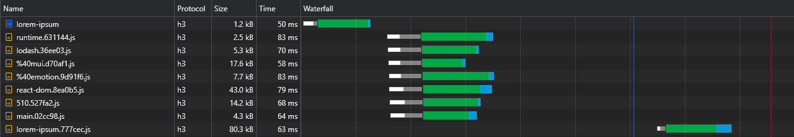
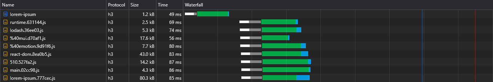
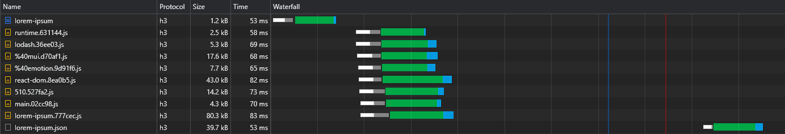
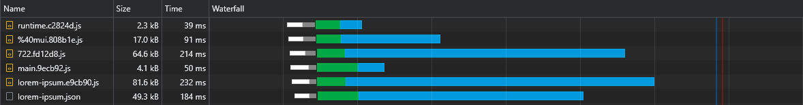
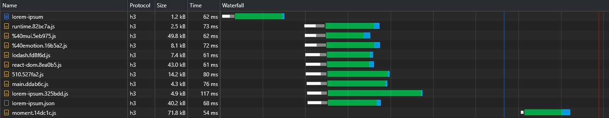
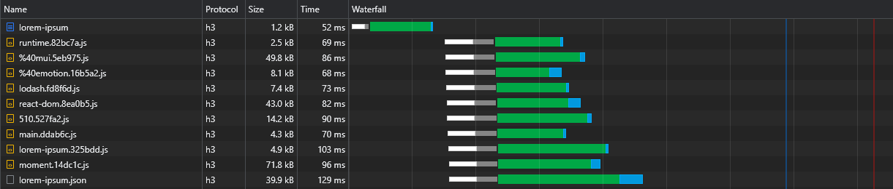
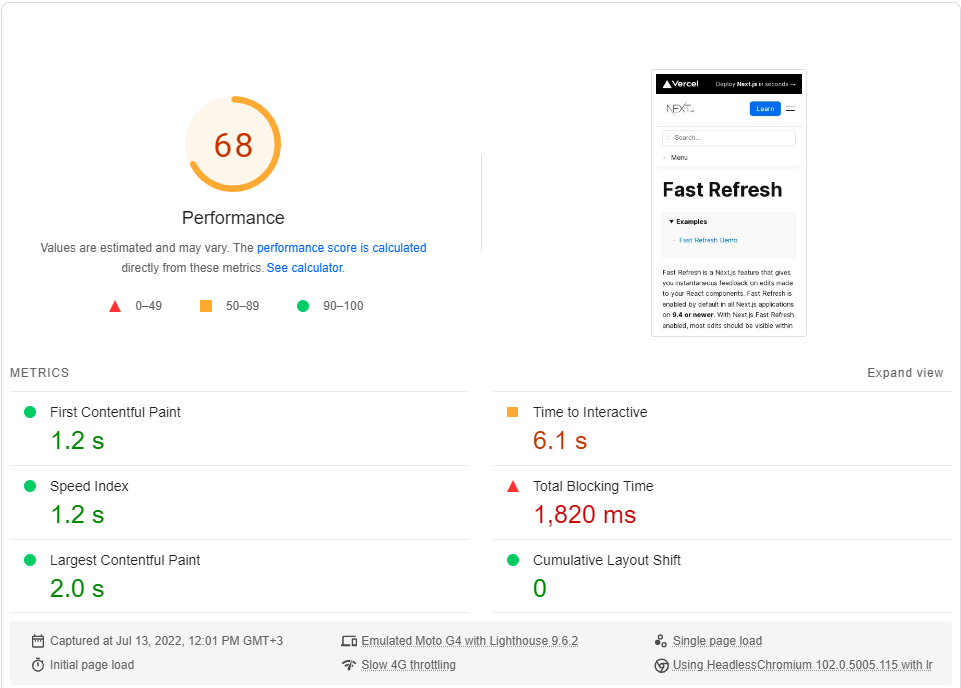
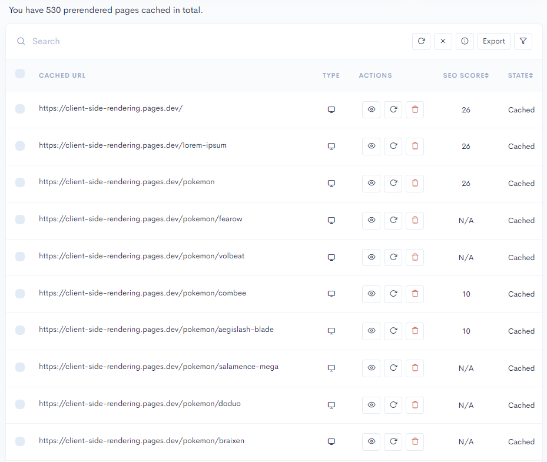

This project is a case study of CSR, it aims to explore the potential of client-side rendered apps in comparison to server-side rendering.

## Table of Contents

- [Motivation](#motivation)
- [Performance](#performance)
  - [Bundle Size](#bundle-size)
  - [Caching](#caching)
  - [Code Splitting](#code-splitting)
  - [Preloading Async Chunks](#preloading-async-chunks)
  - [Generating Static Data](#generating-static-data)
  - [Preloading Data](#preloading-data)
  * [Tweaking Further](#tweaking-further)
    - [Splitting Vendors From Async Chunks](#splitting-vendors-from-async-chunks)
    - [Preloading Other Pages Data](#preloading-other-pages-data)
    - [Preventing Sequenced Rendering](#preventing-sequenced-rendering)
    - [Transitioning Async Pages](#transitioning-async-pages)
    - [Prefetching Async Pages](#prefetching-async-pages)
  - [Deploying](#deploying)
  - [Benchmark](#benchmark)
  - [Areas for Improvement](#areas-for-improvement)
  - [Module Federation](#module-federation)
- [SEO](#seo)
  - [Sitemaps](#sitemaps)
  - [Indexing](#indexing)
    - [Google](#google)
    - [Other Search Engines](#other-search-engines)
  * [Social Media Share Previews](#social-media-share-previews)
- [CSR vs. SSR](#csr-vs-ssr)
  - [SSR Disadvantages](#ssr-disadvantages)
  - [The Cost of Hydration](#the-cost-of-hydration)
- [Conclusion](#conclusion)

# Motivation

Over the last few years, server-side rendering frameworks such as Next.js and Remix started to gain popularity in an increasing pace.
<br>
While SSR has some advantages, those frameworks are bragging about how fast they are ("Performance as a default"), implying client-side rendering is slow.
<br>
In addition, it is a common misconception that great SEO can only be achieved by using SSR, and that CSR apps will give worse results.

This project implements CSR best practices with some tricks that can make it infinitely scalable in terms of performance.
The goal is to simulate a production grade app in terms of number of packages used and try to speed up its loading times as much as possible.

It is important to note that improving performance should not come at the expense of developer experience, so the way this project is architected should vary only slightly compared to "normal" react projects, and it won't be extremely opinionated as Next.js is.

This case study will cover two major aspects: performance and SEO. We will try to inspect how we can achieve great scores in either of them, both compared to SSR and on their own.

_Note: while this project is implemented using React, the majority of it's tweaks are not tied to any framework and are purely browser-based._

# Performance

### Bundle Size

The first rule of thumb is to use as fewer dependencies as possible, and among those, to select the ones with smaller filesize.

For example:
<br>
We can use _[day.js](https://www.npmjs.com/package/dayjs)_ instead of _[moment](https://www.npmjs.com/package/moment)_, _[zustand](https://www.npmjs.com/package/zustand)_ instead of _[redux toolkit](https://www.npmjs.com/package/@reduxjs/toolkit)_ etc.

This is crucial not only for CSR apps, but also for SSR (and SSG) apps, since the bigger our bundle is - the longer it will take the page to be interactive (either through hydration or normal rendering).

### Caching

Ideally, every hashed file should be cached, and `index.html` should **never** be cached.
<br>
It means that the browser would initially cache `main.[hash].js` and would have to redownload it only if its hash (content) changes.

However, since `main.js` includes the entire bundle, the slightest change in code would cause its cache to expire, meaning the browser would have to download it again.
<br>
Now, what part of our bundle comprises most of its weight? The answer is the **dependencies**, also called **vendors**.

So if we could split the vendors to their own hashed chunk, that would allow a separation between our code and the vendors code, leading to less cache invalidations:

```
optimization: {
  runtimeChunk: 'single',
  splitChunks: {
    chunks: 'initial',
    cacheGroups: {
      vendor: {
        test: /[\\/]node_modules[\\/]/,
        name: 'vendors'
      }
    }
  }
}
```

This will create a `vendors.[hash].js` file.

Although this is a substantial improvement, what would happen if we updated a very small dependency?
<br>
In such case, the entire vendors chunk's cache will invalidate.

So, in order to make this even better, we will split **each dependency** to its own hashed chunk:

```diff
- name: 'vendors'
+ name: ({ context }) => (context.match(/[\\/]node_modules[\\/](.*?)([\\/]|$)/) || [])[1]
```

This will create files like `react-dom.[hash].js`, `react-router-dom.[hash].js` etc.

More info about the default configurations (such as the split threshold size) can be found here:
<br>
https://webpack.js.org/plugins/split-chunks-plugin/#defaults

### Code Splitting

A lot of the features we write end up being used only in a few of our pages, so we would like them to be downloaded only when the user visits the page they are being used in.

For Example, we wouldn't want users to download the _[react-big-calendar](https://www.npmjs.com/package/react-big-calendar)_ package if they just loaded the home page. We would only want that to happen when they visit the calendar page.

The way we achieve this is (preferably) by route-based code splitting:

```
const Home = lazy(() => import(/* webpackChunkName: "index" */ 'pages/Home'))
const LoremIpsum = lazy(() => import(/* webpackChunkName: "lorem-ipsum" */ 'pages/LoremIpsum'))
const Pokemon = lazy(() => import(/* webpackChunkName: "pokemon" */ 'pages/Pokemon'))
```

So when the user visits the Lorem Ipsum page, they only download the main chunk script (which includes all shared dependencies such as the framework) and the `lorem-ipsum.[hash].js` chunk.

_Note: I believe that it is completely fine (and even encouraged) to have the user download your entire site (so they can have a smooth **app-like** navigation experience). But it is **very wrong** to have all the assets being downloaded **initially**, delaying the first render of the page.
<br>
These assets should be downloaded after the user-requested page has finished rendering and is visible to the user._

### Preloading Async Chunks

Code splitting has one major flaw - the runtime doesn't know these async chunks are needed until the main script executes, leading to them being fetched in a significant delay:



The way we can solve this issue is by implementing a script in the document that will be responsible of preloading assets:

```
plugins: [
  new HtmlPlugin({
    scriptLoading: 'module',
    templateContent: ({ compilation }) => {
      const pages = pagesManifest.map(({ chunk, path }) => {
        const assets = compilation.getAssets().map(({ name }) => name)
        const script = assets.find(name => name.includes(`/${chunk}.`) && name.endsWith('.js'))

        return { path, script }
      })

      return htmlTemplate(pages)
    }
  })
]
```

```
module.exports = pages => `
  <!DOCTYPE html>
  <html lang="en">
    <head>
      <title>CSR</title>

      <script>
        let { pathname } = window.location

        if (pathname !== '/') pathname = pathname.replace(/\\/$/, '')

        const pages = ${JSON.stringify(pages)}

        for (const { path, script } of pages) {
          if (pathname !== path) continue

          document.head.appendChild(
            Object.assign(document.createElement('link'), { rel: 'preload', href: '/' + script, as: 'script' })
          )

          break
        }
      </script>
    </head>
    <body>
      <div id="root"></div>
    </body>
  </html>
`
```

`pages-manifest.json` can be found [here](src/pages-manifest.json).

_Please note that other types of assets can be preloaded the same way (like stylesheets)._

This way, the browser is able to fetch the page-related script chunk **in parallel** with render-critical assets:



### Generating Static Data

I like the idea of SSG: we create a cacheable HTML file and inject static data into it.
<br>
This can be useful for data that is not highly dynamic, such as content from CMS.

But how can we create static data?
<br>
We will execute the following script during build time:

```
import { mkdir, writeFile } from 'fs/promises'
import axios from 'axios'

const path = 'public/json'
const axiosOptions = { transformResponse: res => res }

mkdir(path, { recursive: true })

const fetchLoremIpsum = async () => {
const { data } = await axios.get('https://loripsum.net/api/200/long/plaintext', axiosOptions)

writeFile(`${path}/lorem-ipsum.json`, JSON.stringify(data))
}

fetchLoremIpsum()
```

That would create a `json/lorem-ipsum.json` file to be stored in the CDN.

And now we simply fetch our static data:

`fetch('json/lorem-ipsum.json')`

There are numerous advantages to this approach:

- We generate static data so we won't bother our server or CMS for every user request.
- The data will be fetched a lot faster from a nearby CDN edge than from a remote server.
- Since this script runs on our server during build time, we can authenticate with services however we want, there is no limit to what can be sent (secret tokens for example).

Whenever we need to update the static data we simply rebuild the app or, better yet, just rerun the script.

### Preloading Data

One of the disadvantages of CSR over SSR is that data will be fetched only after JS has been downloaded, parsed and executed in the browser:



To overcome this, we will use preloading once again, this time for the data itself:

```diff
plugins: [
  new HtmlPlugin({
    scriptLoading: 'module',
    templateContent: ({ compilation }) => {
-     const pages = pagesManifest.map(({ chunk, path }) => {
+     const pages = pagesManifest.map(({ chunk, path, data }) => {
        const assets = compilation.getAssets().map(({ name }) => name)
        const script = assets.find(name => name.includes(`/${chunk}.`) && name.endsWith('.js'))

+       if (data && !Array.isArray(data)) data = [data]

-       return { path, script }
+       return { path, script, data }
      })

      return htmlTemplate(pages)
    }
  })
]
```

```diff
module.exports = pages => `
  <!DOCTYPE html>
  <html lang="en">
    <head>
      <title>CSR</title>

      <script>
+       const isStructureEqual = (pathname, path) => {
+         pathname = pathname.split('/')
+         path = path.split('/')
+
+         if (pathname.length !== path.length) return false
+
+         return pathname.every((segment, ind) => segment === path[ind] || path[ind].includes(':'))
+       }

        let { pathname } = window.location

        if (pathname !== '/') pathname = pathname.replace(/\\/$/, '')

        const pages = ${JSON.stringify(pages)}

-       for (const { path, script } of pages) {
+       for (const { path, script, data } of pages) {
-         if (pathname !== path) continue
+         const match = pathname === path || (path.includes(':') && isStructureEqual(pathname, path))
+
+         if (!match) continue

          document.head.appendChild(
            Object.assign(document.createElement('link'), { rel: 'preload', href: '/' + script, as: 'script' })
          )

+         if (!data) break
+
+          data.forEach(({ url, dynamicPathIndex, crossorigin }) => {
+           let fullURL = url
+
+           if (dynamicPathIndex) {
+             const [id] = pathname.split('/').slice(dynamicPathIndex, dynamicPathIndex + 1)
+
+             if (!id) return
+
+             fullURL = url.replace('$', id)
+           }
+
+           document.head.appendChild(
+             Object.assign(document.createElement('link'), { rel: 'preload', href: fullURL, as: 'fetch', crossOrigin: crossorigin })
+           )
          })

          break
        }
      </script>
    </head>
    <body>
      <div id="root"></div>
    </body>
  </html>
`
```

Now we can see that the data is being fetched right away:



With the above script, we can even preload dynamic routes data (such as _[pokemon/:name](https://client-side-rendering.pages.dev/pokemon/pikachu)_).

The only limitation is that we can only preload GET resources, but this would not be a problem when the backend is well-architected.

## Tweaking Further

### Splitting Vendors From Async Chunks

Code splitting introduced us to a new problem: vendor duplication.

Say we have two async chunks: `lorem-ipsum.[hash].js` and `pokemon.[hash].js`.
If they both include the same dependency that is not part of the main chunk, that means the user will download that dependency **twice**.

So if that said dependency is `moment` and it weighs 72kb minzipped, then both async chunk's size will be **at least** 72kb.

We need to split this dependency from these async chunks so that it could be shared between them:

```diff
optimization: {
  runtimeChunk: 'single',
  splitChunks: {
    chunks: 'initial',
    cacheGroups: {
      vendor: {
        test: /[\\/]node_modules[\\/]/,
+       chunks: 'all',
        name: ({ context }) => (context.match(/[\\/]node_modules[\\/](.*?)([\\/]|$)/) || [])[1]
      }
    }
  }
}
```

Now both `lorem-ipsum.[hash].js` and `pokemon.[hash].js` will use the extracted `moment.[hash].js` chunk, sparing the user a lot of network traffic (and giving these assets better cache persistence).

However, we have no way of telling which async vendor chunks will be split before we build the application, so we wouldn't know which async vendor chunks we need to preload (refer to the "Preloading Async Chunks" section).

Unfortunately, I did not find a way to automatically match an async chunk to its dependencies (through Webpack's compilation object), so we'll have to manually specify these dependencies until an automatic solution will be found.

We can easily find these async dependencies by looking at the waterfall:



Then we will have them being added to the page's HTML:

```diff
plugins: [
  new HtmlPlugin({
    scriptLoading: 'module',
    templateContent: ({ compilation }) => {
-     const pages = pagesManifest.map(({ chunk, path, data }) => {
+     const pages = pagesManifest.map(({ chunk, path, vendors, data }) => {
        const assets = compilation.getAssets().map(({ name }) => name)
        const script = assets.find(name => name.includes(`/${chunk}.`) && name.endsWith('.js'))
+       const vendorScripts = vendors
+         ? assets.filter(name => vendors.find(vendor => name.includes(`/${vendor}.`) && name.endsWith('.js')))
+         : []

        if (data && !Array.isArray(data)) data = [data]

-       return { path, script, data }
+       return { path, scripts: [script, ...vendorScripts], data }
      })

      return htmlTemplate(pages)
    }
  })
]
```

```diff
module.exports = pages => `
  <!DOCTYPE html>
  <html lang="en">
    <head>
      <title>CSR</title>

      <script>
        const isStructureEqual = (pathname, path) => {
          pathname = pathname.split('/')
          path = path.split('/')

          if (pathname.length !== path.length) return false

          return pathname.every((segment, ind) => segment === path[ind] || path[ind].includes(':'))
        }

        let { pathname } = window.location

        if (pathname !== '/') pathname = pathname.replace(/\\/$/, '')

        const pages = ${JSON.stringify(pages)}

-       for (const { path, script, data } of pages) {
+       for (const { path, scripts, data } of pages) {
          const match = pathname === path || (path.includes(':') && isStructureEqual(pathname, path))

          if (!match) continue

+         scripts.forEach(script => {
            document.head.appendChild(
              Object.assign(document.createElement('link'), { rel: 'preload', href: '/' + script, as: 'script' })
            )
+         })

          if (!data) break

           data.forEach(({ url, dynamicPathIndex, crossorigin }) => {
            let fullURL = url

            if (dynamicPathIndex) {
              const [id] = pathname.split('/').slice(dynamicPathIndex, dynamicPathIndex + 1)

              if (!id) return

              fullURL = url.replace('$', id)
            }

            document.head.appendChild(
              Object.assign(document.createElement('link'), { rel: 'preload', href: fullURL, as: 'fetch', crossOrigin: crossorigin })
            )
          })

          break
        }
      </script>
    </head>
    <body>
      <div id="root"></div>
    </body>
  </html>
`
```

Now all async vendor chunks will be fetched in parallel with their parent async chunk:



### Preloading Other Pages Data

We can preload data when hovering over links (desktop) or when links enter the viewport (mobile):

```
const createPreload = url => {
  if (document.head.querySelector(`link[href="${url}"]`)) return

  document.head.appendChild(
    Object.assign(document.createElement('link'), {
      rel: 'preload',
      href: url,
      as: 'fetch'
    })
  )
}
```

### Preventing Sequenced Rendering

When we split a page from the main app, we separate its render phase, meaning the app will render before the page renders:


This happens due to the common approach of wrapping routes with Suspense:

```
const App = () => {
  return (
    <>
      <Navigation />

      <Suspense>
        <Routes>{routes}</Routes>
      </Suspense>
    </>
  )
}
```

This method has a lot of sense to it:
<br>
We would prefer the app to be visually complete in a single render, but we would never want to stall the page render until the async chunk finishes downloading.

However, since we preload all async chunks (and their vendors), this won't be a problem for us. So we should suspense the entire app until the async chunk finishes downloading (which, in our case, happens in parallel with all the render-critical assets):

```
createRoot(document.getElementById('root')).render(
  <BrowserRouter>
    <Suspense>
        <App />
    </Suspense>
  </BrowserRouter>
)
```

This would make our app and the async page visually render at the same time.

### Transitioning Async Pages

_Note: this technique requires React 18_

We will see a similar effect when we move to another async page: a blank space that remains until the page's script finishes downloading.

React 18 introduced us to the useTransition hook, which allows us to delay a render until some criteria are met.
<br>
We will use this hook in to delay the page navigation until it is ready:

```
import { useTransition } from 'react'
import { useNavigate } from 'react-router-dom'

const useDelayedNavigate = () => {
  const [, startTransition] = useTransition()
  const navigate = useNavigate()

  return to => startTransition(() => navigate(to))
}

export default useDelayedNavigate
```

```
const NavigationLink = ({ to, onClick, children }) => {
  const navigate = useDelayedNavigate()

  const onLinkClick = event => {
    event.preventDefault()
    navigate(to)
    onClick?.()
  }

  return (
    <NavLink to={to} onClick={onLinkClick}>
      {children}
    </NavLink>
  )
}

export default NavigationLink
```

Now async pages will feel like they were never split from the main app.

### Prefetching Async Pages

Users should have a smooth navigation experience in our app.
<br>
However, splitting every page causes a noticeable delay in navigation, since every page has to be downloaded before it can be rendered on screen.

That's why I think all pages should be prefetched ahead of time.

We can do this by writing a wrapper function around React's _lazy_ function:

```
import { lazy } from 'react'

const lazyPrefetch = chunk => {
  window.addEventListener('load', () => setTimeout(chunk, 200), { once: true })

  return lazy(chunk)
}

export default lazyPrefetch
```

```diff
- const Home = lazy(() => import(/* webpackChunkName: "index" */ 'pages/Home'))
- const LoremIpsum = lazy(() => import(/* webpackChunkName: "lorem-ipsum" */ 'pages/LoremIpsum'))
- const Pokemon = lazy(() => import(/* webpackChunkName: "pokemon" */ 'pages/Pokemon'))

+ const Home = lazyPrefetch(() => import(/* webpackChunkName: "index" */ 'pages/Home'))
+ const LoremIpsum = lazyPrefetch(() => import(/* webpackChunkName: "lorem-ipsum" */ 'pages/LoremIpsum'))
+ const Pokemon = lazyPrefetch(() => import(/* webpackChunkName: "pokemon" */ 'pages/Pokemon'))
```

Now every page will be prefetched (but not executed) 200ms after the browser's _load_ event.

## Deploying

The biggest advantage of a static app is that it can be served entirely from a CDN.
<br>
A CDN has many PoPs (Points of Presence), also called 'Edge Networks'. These PoPs are distributed around the globe and thus are able to serve files to every region **much** faster than a remote server.

The fastest CDN to date is Cloudflare, which has more than 250 PoPs (and counting):


https://speed.cloudflare.com

https://blog.cloudflare.com/benchmarking-edge-network-performance

We can easily deploy our app using Cloudflare Pages:
<br>
https://pages.cloudflare.com

## Benchmark

To conclude this section, we will perform a benchmark of our app compared to [Next.js](https://nextjs.org/docs/getting-started)'s documentation site (which is **entirely SSG**).
<br>
We will choose a minimalistic page (Fast Refresh) and compare it to our Lorem Ipsum page.
<br>
You can click on each link to perform a live benchmark.

[Fast Refresh | Next.js](https://pagespeed.web.dev/report?url=https%3A%2F%2Fnextjs.org%2Fdocs%2Fbasic-features%2Ffast-refresh)
<br>
[Lorem Ipsum | Client-side Rendering](https://pagespeed.web.dev/report?url=https%3A%2F%2Fclient-side-rendering.pages.dev%2Florem-ipsum)

The benchmark is performed through Google's _PageSpeed Insights_, simulating a slow 4G network.




As it turns out, performance is **not** a default in Next.js.

## Areas for Improvement

- Automatically detect async vendor chunks during build time (refer to _Splitting Vendors From Async Chunks_ section).
- Switch to [Preact](https://preactjs.com) when Suspense becomes stable (for a much smaller bundle size).
- Compress assets using [Brotli level 11](https://d33wubrfki0l68.cloudfront.net/3434fd222424236d1f0f5b4596de1480b5378156/1a5ec/assets/wp-content/uploads/2018/07/compression_estimator_jquery.jpg) (Cloudflare only uses level 4 to save on computing resources).
- Use the paid [Cloudflare Argo](https://blog.cloudflare.com/argo) service for even better response times.

## Module Federation

Applying the same preloading principles in a Module Federation project should be relatively simple:

1. We generate a `pages-manifest.json` file in every micro-frontend.
2. When deploying a micro-frontend, we extract the asset-injected _pages_ constant:

```diff
plugins: [
  new HtmlPlugin({
    scriptLoading: 'module',
    templateContent: ({ compilation }) => {
-     const pages = pagesManifest.map(({ chunk, path, vendors, data }) => {
+     const pages = pagesManifest.map(({ chunk, path, scripts, vendors, data }) => {
+       if (scripts) return { path, scripts, data }

        const assets = compilation.getAssets().map(({ name }) => name)
        const script = assets.find(name => name.includes(`/${chunk}.`) && name.endsWith('.js'))
        const vendorScripts = vendors
          ? assets.filter(name => vendors.find(vendor => name.includes(`/${vendor}.`) && name.endsWith('.js')))
          : []

        if (data && !Array.isArray(data)) data = [data]

        return { path, scripts: [script, ...vendorScripts], data }
      })

+     axios.post({ url: 'https://...', data: pages })
+     // OR
+     fs.writeFileSync('.../some-path', pages)

      return htmlTemplate(pages)
    }
  })
]
```

3. We merge the the _pages_ array with the shell's `pages-manifest.json` file.
4. We deploy the shell.

We will also have to write additional code to preload the `remoteEntry.js` files.

Using this method, every time a micro-frontend is deployed, the shell has to be deployed aswell.
<br>
However, if we have more control over the build files in production, we could spare the shell's deployment by manually editing its `index.html` file and merging the micro-frontend's _pages_ array with the _pages_ constant.

# SEO

## Sitemaps

In order to make all of our app pages discoverable to search engines, we need to create a `sitemap.xml` file which specifies all of our website routes.

Since we already have a centralized `pages-manifest.json` file, we can easily generate a sitemap during build time:

```
import { Readable } from 'stream'
import { writeFile } from 'fs/promises'
import { SitemapStream, streamToPromise } from 'sitemap'

import pagesManifest from '../src/pages-manifest.json' assert { type: 'json' }

const stream = new SitemapStream({ hostname: 'https://client-side-rendering.pages.dev' })
const links = pagesManifest.map(({ path }) => ({ url: path, changefreq: 'daily' }))

streamToPromise(Readable.from(links).pipe(stream))
  .then(data => data.toString())
  .then(res => writeFile('public/sitemap.xml', res))
  .catch(console.log)

```

This will emit the following sitemap:

```
<?xml version="1.0" encoding="UTF-8"?>
<urlset xmlns="http://www.sitemaps.org/schemas/sitemap/0.9" xmlns:image="http://www.google.com/schemas/sitemap-image/1.1" xmlns:news="http://www.google.com/schemas/sitemap-news/0.9" xmlns:video="http://www.google.com/schemas/sitemap-video/1.1" xmlns:xhtml="http://www.w3.org/1999/xhtml">
   <url>
      <loc>https://client-side-rendering.pages.dev/</loc>
      <changefreq>daily</changefreq>
   </url>
   <url>
      <loc>https://client-side-rendering.pages.dev/lorem-ipsum</loc>
      <changefreq>daily</changefreq>
   </url>
   <url>
      <loc>https://client-side-rendering.pages.dev/pokemon</loc>
      <changefreq>daily</changefreq>
   </url>
</urlset>
```

We can manually submit our sitemap to [Google Search Console](https://search.google.com/search-console) and [Bing Webmaster Tools](https://www.bing.com/webmasters).

## Indexing

### Google

It is often said that Google is having trouble correctly indexing CSR (JS) apps.
<br>
That might have been the case in 2018, but as of 2022, Google prefectly indexes every JS app.
<br>
The indexed pages will have a title, description and even content, as long as we remember to dynamically set them (either manually or using something like _[react-helmet](https://www.npmjs.com/package/react-helmet)_).

In other words, it won't matter if we used SSR or not in terms of Google indexing.


The following video explains how the new Googlebot renders JS apps:
<br>
https://www.youtube.com/watch?v=Ey0N1Ry0BPM

### Other Search Engines

Other inferior search engines such as Bing cannot render JS (despite claiming they can). So in order to have them index our app correctly, we will serve them a **prerendered** version of our pages.
<br>
Prerendering is the act of crawling web apps in production (using headless Chromium) and generating a complete HTML file for each page.

We have two options for generating prerendered pages:

1. We can use a dedicated service such as [Prerender.io](https://prerender.io/).



2. We can make our own prerender server using free open-source tools such as [Rendertron](https://github.com/GoogleChrome/rendertron).

Then we redirect web crawlers (identified by their User-Agent header string) to our prerendered pages using Cloudflare Workers:
<br>
[public/\_worker.js](public/_worker.js)

Prerendering, also called _Dynamic Rendering_, is encouraged by [Google](https://developers.google.com/search/docs/advanced/javascript/dynamic-rendering) and [Microsoft](https://blogs.bing.com/webmaster/october-2018/bingbot-Series-JavaScript,-Dynamic-Rendering,-and-Cloaking-Oh-My).

Using prerendering produces the **exact same** SEO results as using SSR in all search engines.

_Note that if you only care about Google indexing, there's little sense to prerendering your website, since Googlebot crawls JS apps flawlessly._

### Social Media Share Previews

When we share a CSR app link in social media, we can see that no matter what page we link to, the preview will remain the same.
<br>
This happens because most CSR apps have only one HTML file, and social share previews do not render JS.
<br>
This is where prerendering comes to our aid once again, we only need to make sure to set the correct meta tags dynamically:

```
export const setMetaTags = ({ title, description }) => {
  document.title = title
  document.head.querySelector('meta[name="description"]').setAttribute('content', description)
  document.head.querySelector('meta[property="og:title"]').setAttribute('content', title)
  document.head.querySelector('meta[property="og:url"]').setAttribute('content', window.location.href)
}
```

```
useEffect(() => {
  const page =
    pagesManifest.find(
      ({ path }) => pathname === path || (path !== '/' && pathname.startsWith(path.replace('/*', '')))
    ) || {}

  setMetaTags(page)
}, [pathname])
```

This, after going through prerendering, gives us the correct preview for every page:


# CSR vs. SSR

## SSR Disadvantages

Here's a list of some SSR cons that should not be taken lightly:

- SSR page responses mostly don't return a _[304 Not Modified](https://blog.hubspot.com/marketing/http-304-not-modified#:~:text=An%20HTTP%20304%20not%20modified%20status%20code%20means%20that%20the,to%20speed%20up%20page%20delivery)_ status.
- When performing client-side data fetching, SSR will **always** be slower than CSR, since its document is always bigger and takes longer to download.
- Since all images are initially included in the document, scripts and images will compete for bandwidth, causing delayed interactivity on slow networks.
- Since accessing browser-related objects during the server render phase throws an error, some very helpful tools become unusable, while others (such as [react-media](https://www.npmjs.com/package/react-media#server-side-rendering-ssr)) require SSR-specific customizations.

## The Cost of Hydration

It is a fact that under fast internet connection, both CSR and SSR perform great (as long as they are both optimized). And the higher the connection speed - the closer they get in terms of loading times.

However, when dealing with slow connections (such as mobile networks), it seems that SSR has an edge over CSR regarding loading times.
<br>
Since SSR apps are rendered on the server, the browser receives the fully-constructed HTML file, and so it can show the page to the user without waiting for JS to download. When JS is eventually download and parsed, the framework is able to "hydrate" the DOM with functionality (without having to reconstruct it).

Although it seems like a big advantage, this behaviour has one major flaw on slow connections - until JS is loaded, users can click wherever they desire, but the app won't react to them.
<br>
It might be somewhat of an inconvenience when buttons don't respond to click events, but it becomes a much larger problem when default events are not being prevented.

This is a comparison between Next.js's website and Client-side Rendering app on a fast 3G connection:


What happened here?
<br>
Since JS hasn't been loaded yet, Next.js's website could not prevent the default behaviour of anchor tags to navigate to another page, resulting in every click on them triggering a full page reload.
<br>
And the slower the connection is - the more severe this issue becomes.

It is impossible for this issue to occur in CSR apps, since the moment they render - JS has already been fully loaded.

# Conclusion

We saw that client-side rendering performance is on par and sometimes even better than SSR in terms of loading times.
We also learned that using prerendering gives perfect SEO results, and that we don't even need to think about it once it is set up.

The above takings lead to the conclusion that there is just no reason to use SSR, it would only add a lot of complexity to our project and degrade the developer experience.
