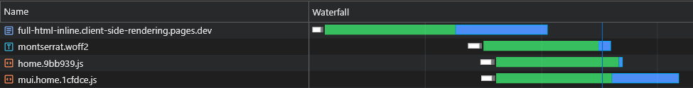
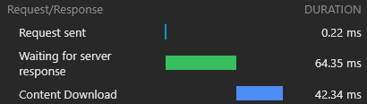
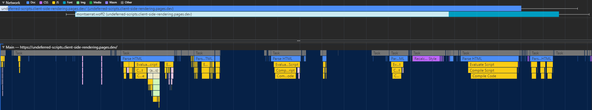

<h1 align="center">Client-side Rendering</h1>

This project is a case study of CSR, it explores the potential of client-side rendered apps compared to server-side rendering.

An in-depth comparison of all rendering methods can be found on this project's _Comparison_ page: https://client-side-rendering.pages.dev/comparison

## Table of Contents

- [Intro](#intro)
- [Motivation](#motivation)
- [Performance](#performance)
  - [Bundle Size](#bundle-size)
  - [Caching](#caching)
  - [Code Splitting](#code-splitting)
  - [Preloading Async Pages](#preloading-async-pages)
  - [Splitting Async Vendors](#splitting-async-vendors)
  - [Preloading Data](#preloading-data)
  - [Precaching](#precaching)
  - [Adaptive Source Inlining](#adaptive-source-inlining)
  - [Leveraging the 304 Status Code](#leveraging-the-304-status-code)
  - [Tweaking Further](#tweaking-further)
    - [Transitioning Async Pages](#transitioning-async-pages)
    - [Preloading Other Pages Data](#preloading-other-pages-data)
    - [Revalidating Active Apps](#revalidating-active-apps)
  - [Summary](#summary)
  - [Deploying](#deploying)
  - [Benchmark](#benchmark)
  - [Areas for Improvement](#areas-for-improvement)
- [SEO](#seo)
  - [Indexing](#indexing)
    - [Google](#google)
    - [Prerendering](#prerendering)
  - [Social Media Share Previews](#social-media-share-previews)
  - [Sitemaps](#sitemaps)
- [CSR vs. SSR](#csr-vs-ssr)
  - [SSR Disadvantages](#ssr-disadvantages)
  - [Why Not SSG?](#why-not-ssg)
  - [The Cost of Hydration](#the-cost-of-hydration)
- [Conclusion](#conclusion)
  - [What Might Change in the Future](#what-might-change-in-the-future)

# Intro

**Client-side rendering (CSR)** refers to sending static assets to the web browser and allowing it to handle the entire rendering process of the app.  
**Server-side rendering (SSR)** involves rendering the entire app (or page) on the server and delivering a pre-rendered HTML document ready for display.  
**Static Site Generation (SSG)** is the process of pre-generating HTML pages as static assets, which are then sent and displayed by the browser.

Contrary to common belief, the SSR process in modern frameworks like **React**, **Angular**, **Vue**, and **Svelte** results in the app rendering twice: once on the server and again on the browser (this is known as "hydration"). Without this second render, the app would be static and uninteractive, essentially behaving like a "lifeless" web page.
<br>
Interestingly, the hydration process does not appear to be faster than a typical render (excluding the painting phase, of course).
<br>
It's also important to note that SSG apps must undergo hydration as well.

In both SSR and SSG, the HTML document is fully constructed, providing the following benefits:

- Web crawlers can index the pages out-of-the-box, which is crucial for SEO.
- The first contentful paint (FCP) is usually very fast (although in SSR, this depends heavily on API server response times).

On the other hand, CSR apps offer the following advantages:

- The app is completely decoupled from the server, meaning it loads independently of the API server's response times, enabling smooth page transitions.
- The developer experience is streamlined, as there's no need to worry about which parts of the code run on the server and which run in the browser.

In this case study, we'll focus on CSR and explore ways to overcome its apparent limitations while leveraging its strengths to the peak.

All optimizations will be incorporated into the deployed app, which can be found here: [https://client-side-rendering.pages.dev](https://client-side-rendering.pages.dev).

# Motivation

_"Recently, SSR (Server Side Rendering) has taken the JavaScript front-end world by storm. The fact that you can now render your sites and apps on the server before sending them to your clients is an absolutely **revolutionary** idea (and totally not what everyone was doing before JS client-side apps got popular in the first place...)._

_However, the same criticisms that were valid for PHP, ASP, JSP, (and such) sites are valid for server-side rendering today. It's slow, breaks fairly easily, and is difficult to implement properly._

_Thing is, despite what everyone might be telling you, you probably don't need SSR. You can get almost all the advantages of it (without the disadvantages) by using prerendering."_

_~[Prerender SPA Plugin](https://github.com/chrisvfritz/prerender-spa-plugin#what-is-prerendering)_

In recent years, server-side rendering has gained significant popularity in the form of frameworks such as _[Next.js](https://nextjs.org)_ and _[Remix](https://remix.run)_ to the point that developers often default to using them without fully understanding their limitations, even in apps that don't need SEO (e.g., those with login requirements).
<br>
While SSR has its advantages, these frameworks continue to emphasize their speed ("Performance as a default"), suggesting that client-side rendering (CSR) is inherently slow.
<br>
Additionally, there is a widespread misconception that perfect SEO can only be achieved with SSR, and that CSR apps cannot be optimized for search engine crawlers.

Another common argument for SSR is that as web apps grow larger, their loading times will continue to increase, leading to poor _[FCP](https://web.dev/fcp)_ performance for CSR apps.

While it’s true that apps are becoming more feature-rich, the size of a single page should actually **decrease** over time.
<br>
This is due to the trend of creating smaller, more efficient versions of libraries and frameworks, such as _zustand_, _day.js_, _headless-ui_, and _react-router v6_.
<br>
We can also observe a reduction in the size of frameworks over time: Angular (74.1kb), React (44.5kb), Vue (34kb), Solid (7.6kb), and Svelte (1.7kb).
<br>
These libraries contribute significantly to the overall weight of a web page’s scripts.
<br>
With proper code-splitting, the initial loading time of a page could **decrease** over time.

This project implements a basic CSR app with optimizations like code-splitting and preloading. The goal is for the loading time of individual pages to remain stable as the app scales.
<br>
The objective is to simulate a production-grade app's package structure and minimize loading times through parallelized requests.

It’s important to note that improving performance should not come at the cost of developer experience. Therefore, the architecture of this project will be only slightly modified from a typical React setup, avoiding the rigid, opinionated structure of frameworks like Next.js, or the limitations of SSR in general.

This case study will focus on two main aspects: performance and SEO. We will explore how to achieve top scores in both areas.

_Note that although this project is implemented using React, most of the optimizations are framework-agnostic and are purely based on the bundler and the web browser._

# Performance

We will assume a standard Webpack (Rspack) setup and add the required customizations as we progress.

### Bundle Size

The first rule of thumb is to minimize dependencies and, among those, choose the ones with the smallest file sizes.

For example:
<br>
We can use _[day.js](https://www.npmjs.com/package/dayjs)_ instead of _[moment](https://www.npmjs.com/package/moment)_, _[zustand](https://www.npmjs.com/package/zustand)_ instead of _[redux toolkit](https://www.npmjs.com/package/@reduxjs/toolkit)_ , etc.

This is important not only for CSR apps but also for SSR (and SSG) apps, as larger bundles result in longer load times, delaying when the page becomes visible or interactive.

### Caching

Ideally, every hashed file should be cached, and `index.html` should **never** be cached.
<br>
It means that the browser would initially cache `main.[hash].js` and would have to redownload it only if its hash (content) changes:


However, since `main.js` includes the entire bundle, the slightest change in code would cause its cache to expire, meaning the browser would have to download it again.
<br>
Now, what part of our bundle comprises most of its weight? The answer is the **dependencies**, also called **vendors**.

So if we could split the vendors to their own hashed chunk, that would allow a separation between our code and the vendors code, leading to less cache invalidations.

Let's add the following _optimization_ to our config file:

_[rspack.config.js](rspack.config.js)_

```js
export default () => {
  return {
    optimization: {
      runtimeChunk: 'single',
      splitChunks: {
        chunks: 'initial',
        cacheGroups: {
          vendors: {
            test: /[\\/]node_modules[\\/]/,
            name: 'vendors'
          }
        }
      }
    }
  }
}
```

This will create a `vendors.[hash].js` file:


Although this is a substantial improvement, what would happen if we updated a very small dependency?
<br>
In such case, the entire vendors chunk's cache will invalidate.

So, in order to improve it even further, we will split **each dependency** to its own hashed chunk:

_[rspack.config.js](rspack.config.js)_

```diff
- name: 'vendors'
+ name: module => {
+  const moduleName = (module.context.match(/[\\/]node_modules[\\/](.*?)([\\/]|$)/) || [])[1]
+
+  return moduleName.replace('@', '')
+ }
```

This will create files like `react-dom.[hash].js` which contain a single big vendor and a `[id].[hash].js` file which contains all the remaining (small) vendors:


More info about the default configurations (such as the split threshold size) can be found here:
<br>
https://webpack.js.org/plugins/split-chunks-plugin/#defaults

### Code Splitting

A lot of the features we write end up being used only in a few of our pages, so we would like them to be loaded only when the user visits the page they are being used in.

For Example, we wouldn't want users to have to wait until the _[react-big-calendar](https://www.npmjs.com/package/react-big-calendar)_ package is downloaded, parsed and executed if they merely loaded the _Home_ page. We would only want that to happen when they visit the _Calendar_ page.

The way we can achieve this is (preferably) by route-based code splitting:

_[App.tsx](src/App.tsx)_

```js
const Home = lazy(() => import(/* webpackChunkName: 'home' */ 'pages/Home'))
const LoremIpsum = lazy(() => import(/* webpackChunkName: 'lorem-ipsum' */ 'pages/LoremIpsum'))
const Pokemon = lazy(() => import(/* webpackChunkName: 'pokemon' */ 'pages/Pokemon'))
```

So when users visit the _Pokemon_ page, they only download the main chunk scripts (which includes all shared dependencies such as the framework) and the `pokemon.[hash].js` chunk.

_Note: it is encouraged to download the entire app so that users will experience instant, app-like, navigations. But it is a bad idea to batch all assets into a single script, delaying the first render of the page.
<br>
These assets should be downloaded asynchronously and only after the user-requested page has finished rendering and is entirely visible._

### Preloading Async Pages

Code splitting has one major flaw - the runtime doesn't know which async chunks are needed until the main script executes, leading to them being fetched in a significant delay (since they make another round-trip to the CDN):


The way we can solve this issue is by writing a custom plugin that will embed a script in the document which will be responsible of preloading relevant assets:

_[rspack.config.js](rspack.config.js)_

```js
import InjectAssetsPlugin from './scripts/inject-assets-plugin.js'

export default () => {
  return {
    plugins: [new InjectAssetsPlugin()]
  }
}
```

_[scripts/inject-assets-plugin.js](scripts/inject-assets-plugin.js)_

```js
import { join } from 'node:path'
import { readFileSync } from 'node:fs'
import HtmlPlugin from 'html-webpack-plugin'

import pagesManifest from '../src/pages.js'

const __dirname = import.meta.dirname

const getPages = rawAssets => {
  const pages = Object.entries(pagesManifest).map(([chunk, { path, title }]) => {
    const script = rawAssets.find(name => name.includes(`/${chunk}.`) && name.endsWith('.js'))

    return { path, script, title }
  })

  return pages
}

class InjectAssetsPlugin {
  apply(compiler) {
    compiler.hooks.compilation.tap('InjectAssetsPlugin', compilation => {
      HtmlPlugin.getCompilationHooks(compilation).beforeEmit.tapAsync('InjectAssetsPlugin', (data, callback) => {
        const preloadAssets = readFileSync(join(__dirname, '..', 'scripts', 'preload-assets.js'), 'utf-8')

        const rawAssets = compilation.getAssets()
        const pages = getPages(rawAssets)

        let { html } = data

        html = html.replace(
          '</title>',
          () => `</title><script id="preload-data">const pages=${stringifiedPages}\n${preloadAssets}</script>`
        )

        callback(null, { ...data, html })
      })
    })
  }
}

export default InjectAssetsPlugin
```

_[scripts/preload-assets.js](scripts/preload-assets.js)_

```js
const isMatch = (pathname, path) => {
  if (pathname === path) return { exact: true, match: true }
  if (!path.includes(':')) return { match: false }

  const pathnameParts = pathname.split('/')
  const pathParts = path.split('/')
  const match = pathnameParts.every((part, ind) => part === pathParts[ind] || pathParts[ind]?.startsWith(':'))

  return {
    exact: match && pathnameParts.length === pathParts.length,
    match
  }
}

const preloadAssets = () => {
  let { pathname } = window.location

  if (pathname !== '/') pathname = pathname.replace(/\/$/, '')

  const matchingPages = pages.map(page => ({ ...isMatch(pathname, page.path), ...page })).filter(({ match }) => match)

  if (!matchingPages.length) return

  const { path, title, script } = matchingPages.find(({ exact }) => exact) || matchingPages[0]

  document.head.appendChild(
    Object.assign(document.createElement('link'), { rel: 'preload', href: '/' + script, as: 'script' })
  )

  if (title) document.title = title
}

preloadAssets()
```

The imported `pages.js` file can be found [here](src/pages.js).

This way, the browser is able to fetch the page-specific script chunk **in parallel** with render-critical assets:


### Splitting Async Vendors

Code splitting introduces another problem: async vendor duplication.

Say we have two async chunks: `lorem-ipsum.[hash].js` and `pokemon.[hash].js`.
If they both include the same dependency that is not part of the main chunk, that means the user will download that dependency **twice**.

So if that said dependency is `moment` and it weighs 72kb minzipped, then both async chunk's size will be **at least** 72kb.

We need to split this dependency from these async chunks so that it could be shared between them:

_[rspack.config.js](rspack.config.js)_

```diff
optimization: {
  runtimeChunk: 'single',
  splitChunks: {
    chunks: 'initial',
    cacheGroups: {
      vendors: {
        test: /[\\/]node_modules[\\/]/,
+       chunks: 'all',
        name: ({ context }) => (context.match(/[\\/]node_modules[\\/](.*?)([\\/]|$)/) || [])[1].replace('@', '')
      }
    }
  }
}
```

Now both `lorem-ipsum.[hash].js` and `pokemon.[hash].js` will use the extracted `moment.[hash].js` chunk, sparing the user a lot of network traffic (and giving these assets better cache persistence).

However, we have no way of telling which async vendor chunks will be split before we build the application, so we wouldn't know which async vendor chunks we need to preload (refer to the "Preloading Async Chunks" section):


That's why we will append the chunks names to the async vendor's name:

_[rspack.config.js](rspack.config.js)_

```diff
optimization: {
  runtimeChunk: 'single',
  splitChunks: {
    chunks: 'initial',
    cacheGroups: {
      vendors: {
        test: /[\\/]node_modules[\\/]/,
        chunks: 'all',
-       name: ({ context }) => (context.match(/[\\/]node_modules[\\/](.*?)([\\/]|$)/) || [])[1].replace('@', '')
+       name: (module, chunks) => {
+         const allChunksNames = chunks.map(({ name }) => name).join('.')
+         const moduleName = (module.context.match(/[\\/]node_modules[\\/](.*?)([\\/]|$)/) || [])[1]

+         return `${moduleName}.${allChunksNames}`.replace('@', '')
        }
      }
    }
  }
}
```

_[scripts/inject-assets-plugin.js](scripts/inject-assets-plugin.js)_

```diff
const getPages = rawAssets => {
  const pages = Object.entries(pagesManifest).map(([chunk, { path, title }]) => {
-   const script = rawAssets.find(name => name.includes(`/${chunk}.`) && name.endsWith('.js'))
+   const scripts = rawAssets.filter(name => new RegExp(`[/.]${chunk}\\.(.+)\\.js$`).test(name))

-   return { path, title, script }
+   return { path, title, scripts }
  })

  return pages
}
```

_[scripts/preload-assets.js](scripts/preload-assets.js)_

```diff
- const { path, title, script } = matchingPages.find(({ exact }) => exact) || matchingPages[0]
+ const { path, title, scripts } = matchingPages.find(({ exact }) => exact) || matchingPages[0]

+ scripts.forEach(script => {
    document.head.appendChild(
      Object.assign(document.createElement('link'), { rel: 'preload', href: '/' + script, as: 'script' })
    )
+ })
```

Now all async vendor chunks will be fetched in parallel with their parent async chunk:


### Preloading Data

One of the presumed disadvantages of CSR over SSR is that the page's data (fetch requests) will be fired only after JS has been downloaded, parsed and executed in the browser:


To overcome this, we will use preloading once again, this time for the data itself, by patching the `fetch` API:

_[scripts/inject-assets-plugin.js](scripts/inject-assets-plugin.js)_

```diff
const getPages = rawAssets => {
-  const pages = Object.entries(pagesManifest).map(([chunk, { path, title }]) => {
+  const pages = Object.entries(pagesManifest).map(([chunk, { path, title, data, preconnect }]) => {
  const scripts = rawAssets.filter(name => new RegExp(`[/.]${chunk}\\.(.+)\\.js$`).test(name))

-   return { path, title, script }
+   return { path, title, scripts, data, preconnect }
  })

  return pages
}

HtmlPlugin.getCompilationHooks(compilation).beforeEmit.tapAsync('InjectAssetsPlugin', (data, callback) => {
  const preloadAssets = readFileSync(join(__dirname, '..', 'scripts', 'preload-assets.js'), 'utf-8')

  const rawAssets = compilation.getAssets()
  const pages = getPages(rawAssets)
+ const stringifiedPages = JSON.stringify(pages, (_, value) => {
+   return typeof value === 'function' ? `func:${value.toString()}` : value
+ })

  let { html } = data

  html = html.replace(
    '</title>',
-   () => `</title><script id="preload-data">const pages=${JSON.stringify(pages)}\n${preloadAssets}</script>`
+   () => `</title><script id="preload-data">const pages=${stringifiedPages}\n${preloadAssets}</script>`
  )

  callback(null, { ...data, html })
})
```

_[scripts/preload-assets.js](scripts/preload-assets.js)_

```diff
const preloadResponses = {}

const originalFetch = window.fetch

window.fetch = async (input, options) => {
  const requestID = `${input.toString()}${options?.body?.toString() || ''}`
  const preloadResponse = preloadResponses[requestID]

  if (preloadResponse) {
    if (!options?.preload) delete preloadResponses[requestID]

    return preloadResponse
  }

  const response = originalFetch(input, options)

  if (options?.preload) preloadResponses[requestID] = response

  return response
}
.
.
.
const getDynamicProperties = (pathname, path) => {
  const pathParts = path.split('/')
  const pathnameParts = pathname.split('/')
  const dynamicProperties = {}

  for (let i = 0; i < pathParts.length; i++) {
    if (pathParts[i].startsWith(':')) dynamicProperties[pathParts[i].slice(1)] = pathnameParts[i]
  }

  return dynamicProperties
}

const preloadAssets = () => {
-   const { path, title, scripts } = matchingPages.find(({ exact }) => exact) || matchingPages[0]
+   const { path, title, scripts, data, preconnect } = matchingPages.find(({ exact }) => exact) || matchingPages[0]
    .
    .
    .
  data?.forEach(({ url, ...request }) => {
    if (url.startsWith('func:')) url = eval(url.replace('func:', ''))

    const constructedURL = typeof url === 'string' ? url : url(getDynamicProperties(pathname, path))

    fetch(constructedURL, { ...request, preload: true })
  })

  preconnect?.forEach(url => {
    document.head.appendChild(Object.assign(document.createElement('link'), { rel: 'preconnect', href: url }))
  })
}

preloadAssets()
```

Reminder: the `pages.js` file can be found [here](src/pages.js).

Now we can see that the data is being fetched right away:


With the above script, we can even preload dynamic routes data (such as _[pokemon/:name](https://client-side-rendering.pages.dev/pokemon/pikachu)_).

### Precaching

Users should have a smooth navigation experience in our app.
<br>
However, splitting every page causes a noticeable delay in navigation, since every page has to be downloaded (on-demand) before it can be rendered on screen.

We would want to prefetch and cache all pages ahead of time.

We can do this by writing a simple service worker:

_[rspack.config.js](rspack.config.js)_

```js
import { InjectManifestPlugin } from 'inject-manifest-plugin'

import InjectAssetsPlugin from './scripts/inject-assets-plugin.js'

export default () => {
  return {
    plugins: [
      new InjectManifest({
        include: [/fonts\//, /scripts\/.+\.js$/],
        swSrc: join(__dirname, 'public', 'service-worker.js'),
        compileSrc: false,
        maximumFileSizeToCacheInBytes: 10000000
      }),
      new InjectAssetsPlugin()
    ]
  }
}
```

_[service-worker-registration.ts](src/utils/service-worker-registration.ts)_

```js
const register = () => {
  window.addEventListener('load', async () => {
    try {
      await navigator.serviceWorker.register('/service-worker.js')

      console.log('Service worker registered!')
    } catch (err) {
      console.error(err)
    }
  })
}

const unregister = async () => {
  try {
    const registration = await navigator.serviceWorker.ready

    await registration.unregister()

    console.log('Service worker unregistered!')
  } catch (err) {
    console.error(err)
  }
}

if ('serviceWorker' in navigator) {
  const shouldRegister = process.env.NODE_ENV !== 'development'

  if (shouldRegister) register()
  else unregister()
}
```

_[public/service-worker.js](public/service-worker.js)_

```js
const CACHE_NAME = 'my-csr-app'

const allAssets = self.__WB_MANIFEST.map(({ url }) => url)

const getCache = () => caches.open(CACHE_NAME)

const getCachedAssets = async cache => {
  const keys = await cache.keys()

  return keys.map(({ url }) => `/${url.replace(self.registration.scope, '')}`)
}

const precacheAssets = async ({ ignoreAssets }) => {
  const cache = await getCache()
  const cachedAssets = await getCachedAssets(cache)
  const assetsToPrecache = allAssets.filter(asset => !cachedAssets.includes(asset) && !ignoreAssets.includes(asset))

  await cache.addAll(assetsToPrecache)
}

const removeUnusedAssets = async () => {
  const cache = await getCache()
  const cachedAssets = await getCachedAssets(cache)

  cachedAssets.forEach(asset => {
    if (!allAssets.includes(asset)) cache.delete(asset)
  })
}

const handleFetch = async request => {
  const cache = await getCache()
  const cachedResponse = await cache.match(request)

  return cachedResponse || fetch(request)
}

self.addEventListener('install', () => {
  self.skipWaiting()

  precacheAssets()
  removeUnusedAssets()
})

self.addEventListener('fetch', async event => {
  if (['font', 'script'].includes(event.request.destination)) {
    event.respondWith(handleFetch(event.request))
  }
})
```

Now all pages will be prefetched and cached even before the user tries to navigate to them.

This approach will also generate a full _[code cache](https://v8.dev/blog/code-caching-for-devs#use-service-worker-caches)_.

## Adaptive Source Inlining

When inspecting our 43kb `react-dom.js` file, we can see that the time it took for the request to return was 60ms while the time it took to download the file was 3ms:


This demonstrates the well-known fact that [RTT](https://en.wikipedia.org/wiki/Round-trip_delay) has a huge impact on web pages load times, sometimes even more than download speed, and even when assets are served from a nearby CDN edge like in our case.

Additionally and more importantly, we can see that after the HTML file is downloaded, we have a large timespan where the browser stays idle and just waits for the scripts to arrive:


This is a lot of precious time (marked in red) that the browser could use to download, parse and even execute scripts, speeding up the page's visibility and interactivity.
<br>
This inefficiency will reoccur every time assets change (partial cache). This isn't something that only happens on the very first visit.

So how can we eliminate this idle time?
<br>
We could inline all the initial (critical) scripts in the document, so that they will start to download, parse and execute until the async page assets arrive:



We can see that the browser now gets its initial scripts without having to send another request to the CDN.
<br>
So the browser will first send requests for the async chunks and the preloaded data, and while these are pending, it will continue to download and execute the main scripts.
<br>
We can see that the async chunks start to download (marked in blue) right after the HTML file finishes downloading, parsing and executing, which saves a lot of time.

While this change is making a significant difference on fast networks, it is even more crucial for slower networks, where the delay is larger and the RTT is much more impactful.

However, this solution has 2 major issues:

1. We wouldn’t want users to download the 100kb+ HTML file every time they visit our app. We only want that to happen for the very first visit.
2. Since we do not inline the async page’s assets as well, we would probably still be waiting for them to fetch even after the entire HTML has finished downloading, parsing and executing.

To overcome these issues, we can no longer stick to a static HTML file, and so we shall leaverage the power of a server. Or, more precisely, the power of a Cloudflare serverless worker.
<br>
This worker should intercept every HTML document request and tailor a response that fits it perfectly.

The entire flow should be described as follows:

1. The browser sends an HTML document request to the Clouflare worker.
2. The Clouflare worker checks for the existence of an `X-Cached` header in the request.
   If such header exists, it will iterate over its values and inline only the relevant* assets that are absent from it in the response.
   If such header doesn't exist, it will inline all the relevant* assets in the response.
3. The app will then extract all of the inlined assets, cache them in a service worker and then precache all of the other assets.
4. The next time the page is reloaded, the service worker will send the HTML document along with an `X-Cached` header specifying all of its cached assets.

\* Both initial and page-specific assets.

This ensures that the browser receives exactly the assets it needs (no more, no less) to display the current page **in a single roundtrip**!

_[scripts/inject-assets-plugin.js](scripts/inject-assets-plugin.js)_

```js
class InjectAssetsPlugin {
  apply(compiler) {
    const production = compiler.options.mode === 'production'

    compiler.hooks.compilation.tap('InjectAssetsPlugin', compilation => {
      .
      .
      .
    })

    if (!production) return

    compiler.hooks.afterEmit.tapAsync('InjectAssetsPlugin', (compilation, callback) => {
      let html = readFileSync(join(__dirname, '..', 'build', 'index.html'), 'utf-8')
      let worker = readFileSync(join(__dirname, '..', 'build', '_worker.js'), 'utf-8')

      const rawAssets = compilation.getAssets()
      const pages = getPages(rawAssets)
      const assets = rawAssets
        .filter(({ name }) => /^scripts\/.+\.js$/.test(name))
        .map(({ name, source }) => ({
          url: `/${name}`,
          source: source.source(),
          parentPaths: pages.filter(({ scripts }) => scripts.includes(name)).map(({ path }) => path)
        }))

      const initialModuleScriptsString = html.match(/<script\s+type="module"[^>]*>([\s\S]*?)(?=<\/head>)/)[0]
      const initialModuleScripts = initialModuleScriptsString.split('</script>')
      const initialScripts = assets
        .filter(({ url }) => initialModuleScriptsString.includes(url))
        .map(asset => ({ ...asset, order: initialModuleScripts.findIndex(script => script.includes(asset.url)) }))
        .sort((a, b) => a.order - b.order)
      const asyncScripts = assets.filter(asset => !initialScripts.includes(asset))

      html = html
        .replace(/,"scripts":\s*\[(.*?)\]/g, () => '')
        .replace(/scripts\.forEach[\s\S]*?data\?\.\s*forEach/, () => 'data?.forEach')
        .replace(/preloadAssets/g, () => 'preloadData')

      worker = worker
        .replace('INJECT_INITIAL_MODULE_SCRIPTS_STRING_HERE', () => JSON.stringify(initialModuleScriptsString))
        .replace('INJECT_INITIAL_SCRIPTS_HERE', () => JSON.stringify(initialScripts))
        .replace('INJECT_ASYNC_SCRIPTS_HERE', () => JSON.stringify(asyncScripts))
        .replace('INJECT_HTML_HERE', () => JSON.stringify(html))

      writeFileSync(join(__dirname, '..', 'build', '_worker.js'), worker)

      callback()
    })
  }
}

export default InjectAssetsPlugin
```

_[public/\_worker.js](public/_worker.js)_

```js
const initialModuleScriptsString = INJECT_INITIAL_MODULE_SCRIPTS_STRING_HERE
const initialScripts = INJECT_INITIAL_SCRIPTS_HERE
const asyncScripts = INJECT_ASYNC_SCRIPTS_HERE
const html = INJECT_HTML_HERE

const documentHeaders = { 'Cache-Control': 'public, max-age=0', 'Content-Type': 'text/html; charset=utf-8' }

const isMatch = (pathname, path) => {
  if (pathname === path) return { exact: true, match: true }
  if (!path.includes(':')) return { match: false }

  const pathnameParts = pathname.split('/')
  const pathParts = path.split('/')
  const match = pathnameParts.every((part, ind) => part === pathParts[ind] || pathParts[ind]?.startsWith(':'))

  return {
    exact: match && pathnameParts.length === pathParts.length,
    match
  }
}

export default {
  fetch(request, env) {
    const pathname = new URL(request.url).pathname.toLowerCase()
    const userAgent = (request.headers.get('User-Agent') || '').toLowerCase()
    const bypassWorker = ['prerender', 'googlebot'].includes(userAgent) || pathname.includes('.')

    if (bypassWorker) return env.ASSETS.fetch(request)

    const cachedScripts = request.headers.get('X-Cached')?.split(', ').filter(Boolean) || []
    const uncachedScripts = [...initialScripts, ...asyncScripts].filter(({ url }) => !cachedScripts.includes(url))

    if (!uncachedScripts.length) {
      return new Response(html, { headers: documentHeaders })
    }

    let body = html.replace(initialModuleScriptsString, () => '')

    const injectedInitialScriptsString = initialScripts
      .map(({ url, source }) =>
        cachedScripts.includes(url) ? `<script src="${url}"></script>` : `<script id="${url}">${source}</script>`
      )
      .join('\n')

    body = body.replace('</body>', () => `<!-- INJECT_ASYNC_SCRIPTS_HERE -->${injectedInitialScriptsString}\n</body>`)

    const matchingPageScripts = asyncScripts
      .map(asset => {
        const parentsPaths = asset.parentPaths.map(path => ({ path, ...isMatch(pathname, path) }))
        const parentPathsExactMatch = parentsPaths.some(({ exact }) => exact)
        const parentPathsMatch = parentsPaths.some(({ match }) => match)

        return { ...asset, exact: parentPathsExactMatch, match: parentPathsMatch }
      })
      .filter(({ match }) => match)
    const exactMatchingPageScripts = matchingPageScripts.filter(({ exact }) => exact)
    const pageScripts = exactMatchingPageScripts.length ? exactMatchingPageScripts : matchingPageScripts
    const uncachedPageScripts = pageScripts.filter(({ url }) => !cachedScripts.includes(url))
    const injectedAsyncScriptsString = uncachedPageScripts.reduce(
      (str, { url, source }) => `${str}\n<script id="${url}">${source}</script>`,
      ''
    )

    body = body.replace('<!-- INJECT_ASYNC_SCRIPTS_HERE -->', () => injectedAsyncScriptsString)

    return new Response(body, { headers: documentHeaders })
  }
}
```

_[src/utils/extract-inline-scripts.ts](src/utils/extract-inline-scripts.ts)_

```js
const extractInlineScripts = () => {
  const inlineScripts = [...document.body.querySelectorAll('script[id]:not([src])')].map(({ id, textContent }) => ({
    url: id,
    source: textContent
  }))

  return inlineScripts
}

export default extractInlineScripts
```

_[src/utils/service-worker-registration.ts](src/utils/service-worker-registration.ts)_

```js
import extractInlineScripts from './extract-inline-scripts'

const register = () => {
  window.addEventListener('load', async () => {
    try {
      const registration = await navigator.serviceWorker.register('/service-worker.js')

      console.log('Service worker registered!')

      registration.addEventListener('updatefound', () => {
        registration.installing?.postMessage({ type: 'cache-assets', inlineAssets: extractInlineScripts() })
      })

      setInterval(() => registration.update(), ACTIVE_REVALIDATION_INTERVAL * 1000)
    } catch (err) {
      console.error(err)
    }
  })
}
```

_[public/service-worker.js](public/service-worker.js)_

```js
const CACHE_NAME = 'my-csr-app'

const allAssets = self.__WB_MANIFEST.map(({ url }) => url)

const createPromiseResolve = () => {
  let resolve
  const promise = new Promise(res => (resolve = res))

  return [promise, resolve]
}

const [precacheAssetsPromise, precacheAssetsResolve] = createPromiseResolve()

const getCache = () => caches.open(CACHE_NAME)

const getCachedAssets = async cache => {
  const keys = await cache.keys()

  return keys.map(({ url }) => `/${url.replace(self.registration.scope, '')}`)
}

const cacheInlineAssets = async assets => {
  const cache = await getCache()

  assets.forEach(({ url, source }) => {
    const response = new Response(source, {
      headers: {
        'Cache-Control': 'public, max-age=31536000, immutable',
        'Content-Type': 'application/javascript'
      }
    })

    cache.put(url, response)

    console.log(`Cached %c${url}`, 'color: yellow; font-style: italic;')
  })
}

const precacheAssets = async ({ ignoreAssets }) => {
  const cache = await getCache()
  const cachedAssets = await getCachedAssets(cache)
  const assetsToPrecache = allAssets.filter(asset => !cachedAssets.includes(asset) && !ignoreAssets.includes(asset))

  await cache.addAll(assetsToPrecache)
  await removeUnusedAssets()
  await fetchDocument('/')
}

const removeUnusedAssets = async () => {
  const cache = await getCache()
  const cachedAssets = await getCachedAssets(cache)

  cachedAssets.forEach(asset => {
    if (!allAssets.includes(asset)) cache.delete(asset)
  })
}

const fetchDocument = async url => {
  const cache = await getCache()
  const cachedAssets = await getCachedAssets(cache)
  const cachedDocument = await cache.match('/')

  try {
    const response = await fetch(url, {
      headers: { 'X-Cached': cachedAssets.join(', ') }
    })

    return response
  } catch (err) {
    return cachedDocument
  }
}

const fetchAsset = async request => {
  const cache = await getCache()
  const cachedResponse = await cache.match(request)

  return cachedResponse || fetch(request)
}

self.addEventListener('install', event => {
  event.waitUntil(precacheAssetsPromise)
  self.skipWaiting()
})

self.addEventListener('message', async event => {
  const { type, inlineAssets } = event.data

  if (type !== 'cache-assets') return

  await cacheInlineAssets(inlineAssets)
  await precacheAssets({ ignoreAssets: inlineAssets.map(({ url }) => url) })

  precacheAssetsResolve()
})

self.addEventListener('fetch', async event => {
  const { request } = event

  if (request.destination === 'document') return event.respondWith(fetchDocument(request.url))
  if (['font', 'script'].includes(request.destination)) event.respondWith(fetchAsset(request))
})
```

The results for a fresh (entirely uncached) load are exceptional:






On the next load, the Cloudflare worker responds with a minimal (1.8kb) HTML document and all assets are immediately served from the cache.

This optimization leads us to another one - splitting chunks to even smaller pieces.

As a rule of thumb, splitting the bundle into too many chunks can hurt performance. This is because the page won't be rendered until all of its files are downloaded, and the more chunks there are, the greater the likelihood that one of them will be delayed (as hardware and network speed are non-linear).
<br>
But in our case its irrelevant, since we inline all the relevant chunks and so they are fetched all at once.

_[rspack.config.js](rspack.config.js)_

```diff
optimization: {
  splitChunks: {
    chunks: 'initial',
    cacheGroups: {
      vendors: {
+       minSize: 10000,
      }
    }
  }
},
```

This extreme splitting will lead to a better cache persistence, and in turn, to faster load times with partial cache.

### Leveraging the 304 Status Code

When a static asset is fetched from a CDN, it includes an `ETag` header, which is a content hash of the resource. On subsequent requests, the browser checks if it has a stored ETag. If it does, it sends the ETag in an `If-None-Match` header. The CDN then compares the received ETag with the current one: if they match, it returns a `304 Not Modified` status, indicating the browser can use the cached asset; if not, it returns the new asset with a `200` status.

In a traditional CSR app, reloading a page results in the HTML getting a `304 Not Modified`, with other assets served from the cache. Each route has a unique ETag, so `/lorem-ipsum` and `/pokemon` have different cache entries, even if their ETags are identical.

In a CSR SPA, since there's only one HTML file, the same ETag is used for every page request. However, because the ETag is stored per route, the browser won't send an `If-None-Match` header for unvisited pages, leading to a `200` status and a redownload of the HTML, even though it's the same file.

However, we can easily create our own (improved) implementation of this behavior through collaboration between the workers:

_[scripts/inject-assets-plugin.js](scripts/inject-assets-plugin.js)_

```diff
+import { createHash } from 'node:crypto'

class InjectAssetsPlugin {
  apply(compiler) {
    .
    .
    .
    compiler.hooks.afterEmit.tapAsync('InjectAssetsPlugin', (compilation, callback) => {
      let html = readFileSync(join(__dirname, '..', 'build', 'index.html'), 'utf-8')
      let worker = readFileSync(join(__dirname, '..', 'build', '_worker.js'), 'utf-8')
      .
      .
      .
+     const htmlChecksum = createHash('sha256').update(html).digest('hex')
      .
      .
      .
      worker = worker
        .replace('INJECT_INITIAL_MODULE_SCRIPTS_STRING_HERE', () => JSON.stringify(initialModuleScriptsString))
        .replace('INJECT_INITIAL_SCRIPTS_HERE', () => JSON.stringify(initialScripts))
        .replace('INJECT_ASYNC_SCRIPTS_HERE', () => JSON.stringify(asyncScripts))
        .replace('INJECT_HTML_HERE', () => JSON.stringify(html))
+       .replace('INJECT_HTML_CHECKSUM_HERE', () => JSON.stringify(htmlChecksum))

      writeFileSync(join(__dirname, '..', 'build', '_worker.js'), worker)

      callback()
    })
  }
}
```

_[public/\_worker.js](public/_worker.js)_

```diff
+const htmlChecksum = INJECT_HTML_CHECKSUM_HERE
.
.
.
export default {
  fetch(request, env) {
+   const contentHash = request.headers.get('X-Content-Hash')

+   if (contentHash === htmlChecksum) return new Response(null, { status: 304, headers: documentHeaders })
    .
    .
    .
  }
}
```

_[public/service-worker.js](public/service-worker.js)_

```diff
.
.
.
const precacheAssets = async ({ ignoreAssets }) => {
  .
  .
  .
+ await fetchDocument('/')
}

const fetchDocument = async url => {
  const cache = await getCache()
  const cachedAssets = await getCachedAssets(cache)
  const cachedDocument = await cache.match('/')
  const contentHash = cachedDocument?.headers.get('X-Content-Hash')
  const headers = { 'X-Cached': cachedAssets.join(', '), 'X-Content-Hash': contentHash }

  try {
    const response = await fetch(url, { headers })

    if (response.status === 304) return cachedDocument

    cache.put('/', response.clone())

    return response
  } catch (err) {
    return cachedDocument
  }
}

const handleFetch = async request => {
  const cache = await getCache()

+ if (request.destination === 'document') return fetchDocument(request.url)

  const cachedResponse = await cache.match(request)

  return cachedResponse || fetch(request)
}

```

Now our serverless worker will always respond with a `304 Not Modified` status code whenever there are no changes, even for unvisited pages.

## Tweaking Further

### Transitioning Async Pages

_Note: requires React (v18), Svelte or Solid.js_

When we split a page from the main app, we separate its render phase, meaning the app will render before the page renders.
<br>
So when we move from one async page to another, we see a blank space that remains until the page is rendered:


This happens due to the common approach of wrapping only the routes with Suspense:

```js
const App = () => {
  return (
    <>
      <Navigation />

      <Suspense>
        <Routes>{routes}</Routes>
      </Suspense>
    </>
  )
}
```

React 18 introduced us to the `useTransition` hook, which allows us to delay a render until some criteria are met.
<br>
We will use this hook to delay the page's navigation until it is ready:

_[useTransitionNavigate.ts](https://github.com/theninthsky/frontend-essentials/blob/main/src/hooks/useTransitionNavigate.ts)_

```js
import { useTransition } from 'react'
import { useNavigate } from 'react-router-dom'

const useTransitionNavigate = () => {
  const [, startTransition] = useTransition()
  const navigate = useNavigate()

  return (to, options) => startTransition(() => navigate(to, options))
}

export default useTransitionNavigate
```

_[NavigationLink.tsx](src/components/NavigationLink.tsx)_

```js
const NavigationLink = ({ to, onClick, children }) => {
  const navigate = useTransitionNavigate()

  const onLinkClick = event => {
    event.preventDefault()
    navigate(to)
    onClick?.()
  }

  return (
    <NavLink to={to} onClick={onLinkClick}>
      {children}
    </NavLink>
  )
}

export default NavigationLink
```

Now async pages will feel like they were never split from the main app.

### Preloading Other Pages Data

We can preload other pages data when hovering over links (desktop) or when links enter the viewport (mobile):

_[NavigationLink.tsx](src/components/common/NavigationLink.tsx)_

```js
<NavLink onMouseEnter={() => fetch(url, { ...request, preload: true })}>{children}</NavLink>
```

_Note that this may unnecessarily load the API server._

### Revalidating Active Apps

Some users leave the app open for extended periods of time, so another thing we can do is revalidate (download new assets of) the app while it is running:

_[service-worker-registration.ts](src/utils/service-worker-registration.ts)_

```diff
+ const ACTIVE_REVALIDATION_INTERVAL = 10 * 60

const register = () => {
  window.addEventListener('load', async () => {
    try {
      const registration = await navigator.serviceWorker.register('/service-worker.js')

      console.log('Service worker registered!')

      registration.addEventListener('updatefound', () => {
        registration.installing?.postMessage({ type: 'cache-assets', inlineAssets: extractInlineScripts() })
      })

+     setInterval(() => registration.update(), ACTIVE_REVALIDATION_INTERVAL * 1000)
    } catch (err) {
      console.error(err)
    }
  })
}
```

The code above revalidates the app every 10 minutes.

The revalidation process is extremely cheap, since it only involves refetching the service worker (which will return a _304 Not Modified_ status code if not changed).
<br>
When the service worker **does** change, it means that new assets are available, and so they will be selectively downloaded and cached.

## Summary

We split our bundle into many small chunks, greatly improving our app's caching abilities.
<br>
We split every page so that upon loading one, only what is relevent is being downloaded right away.
<br>
We've managed to make the initial (cacheless) load of our app extremely fast, everything that a page requires to load is dynamically injected to it.
<br>
We even preload the page's data, eliminating the famous data fetching waterfall that CSR apps are known to have.
<br>
In addition, we precache all pages, which makes it seem as if they were never split from the main bundle code.
<br>

All of these were achieved without compromising on the developer experience and without dictating which JS framework to choose.

## Deploying

The biggest advantage of a static app is that it can be served entirely from a CDN.
<br>
A CDN has many PoPs (Points of Presence), also called "Edge Networks". These PoPs are distributed around the globe and thus are able to serve files to every region **much** faster than a remote server.

The fastest CDN to date is Cloudflare, which has more than 250 PoPs (and counting):


https://speed.cloudflare.com

https://blog.cloudflare.com/benchmarking-edge-network-performance

We can easily deploy our app using Cloudflare Pages:
<br>
https://pages.cloudflare.com

## Benchmark

To conclude this section, we will perform a benchmark of our app compared to _[Next.js](https://nextjs.org/docs/getting-started)_'s documentation site, which is **entirely SSG**.
<br>
We will compare the minimalistic _Accessibility_ page to our _Lorem Ipsum_ page. Both pages include ~246kb of JS in their render-critical chunks (preloads and prefetches that come after are irrelevant).
<br>
You can click on each link to perform a live benchmark.

_[Accessibility | Next.js](https://pagespeed.web.dev/report?url=https%3A%2F%2Fnextjs.org%2Fdocs%2Faccessibility)_
<br>
_[Lorem Ipsum | Client-side Rendering](https://pagespeed.web.dev/report?url=https%3A%2F%2Fclient-side-rendering.pages.dev%2Florem-ipsum)_

I performed Google's _PageSpeed Insights_ benchmark (simulating a slow 4G network) about 20 times for each page and picked the highest score.
<br>
These are the results:


As it turns out, performance is **not** a default in Next.js.

_Note that this benchmark only tests the first load of the page, without even considering how the app performs when it is fully cached (where CSR really shines)._

## Areas for Improvement

- Compress assets using _[Brotli level 11](https://d33wubrfki0l68.cloudfront.net/3434fd222424236d1f0f5b4596de1480b5378156/1a5ec/assets/wp-content/uploads/2018/07/compression_estimator_jquery.jpg)_ (Cloudflare only uses level 4 to save on computing resources).
- Use the paid _[Cloudflare Argo](https://blog.cloudflare.com/argo)_ service for even better response times.

# SEO

## Indexing

### Google

It is a common minconception that Google is having trouble properly indexing CSR (JS) apps.
<br>
That might have been the case in 2017, but as of today: Google indexes CSR apps mostly flawlessly.

Indexed pages will have a title, description, content and all other SEO-related attributes, as long as we remember to dynamically set them (either manually like [this](https://github.com/theninthsky/frontend-essentials/blob/main/src/components/Meta.tsx) or using a package such as _[react-helmet](https://www.npmjs.com/package/react-helmet)_).

https://www.google.com/search?q=site:https://client-side-rendering.pages.dev


Googlebot's ability the render JS can be easily demonstrated by performing a live URL test of our app in the _[Google Search Console](https://search.google.com/search-console)_:


Googlebot uses the latest version of Chromium to crawl apps, so the only thing we should do is make sure our app loads fast and that it is quick to fetch data.

Even when data takes long time to fetch, Googlebot, in most cases, will wait for it before taking a snapshot of the page:
<br>
https://support.google.com/webmasters/thread/202552760/for-how-long-does-googlebot-wait-for-the-last-http-request
<br>
https://support.google.com/webmasters/thread/165370285?hl=en&msgid=165510733

A detailed explanation of Googlebot's JS crawling process can be found here:
<br>
https://developers.google.com/search/docs/crawling-indexing/javascript/javascript-seo-basics

If Googlebot fails to render some pages, it is mostly due to Google's unwillingness to spend the required resources to crawl the website, which means it has a low _[Crawl Budget](https://developers.google.com/search/blog/2017/01/what-crawl-budget-means-for-googlebot)_.
<br>
This can be confirmed by inspecting the crawled page (by clicking _View Crawled Page_ in the search console) and making sure all failed requests have the _Other error_ alert (which means those requests were intentionally aborted by Googlebot):


This should only happen to websites that Google deems to have no interesting content or have very low traffic (such as our demo app).

More information can be found here: https://support.google.com/webmasters/thread/4425254?hl=en&msgid=4426601

### Prerendering

Other search engines such as Bing cannot render JS, so in order to have them crawl our app properly, we need to serve them **prerendered** version of our pages.
<br>
Prerendering is the act of crawling web apps in production (using headless Chromium) and generating a complete HTML file (with data) for each page.

We have two options when it comes to prerendering:

1. We can deploy our own prerender server using _[Prerender](https://github.com/prerender/prerender)_ (or my own _[Renderless](https://github.com/frontend-infra/renderless.git)_).
2. We can use a dedicated service such as _[Prerender.io](https://prerender.io)_ which is very expensive but offers 1000 free prerenders a month.

**Serverless prerendering is the recommended approach** since it can be very cheap, especially on _[GCP](https://cloud.google.com)_.

Then we redirect web crawlers (identified by their `User-Agent` header string) to our prerenderer, using a Cloudflare Worker (for example):

_[public/\_worker.js](public/_worker.js)_

```js
const BOT_AGENTS = ['bingbot', 'yandex', 'twitterbot', 'whatsapp', ...]

const fetchPrerendered = async ({ url, headers }, userAgent) => {
  const headersToSend = new Headers(headers)

  /* Custom Prerenderer */
  const prerenderUrl = new URL(`${YOUR_PRERENDERER_URL}?url=${url}`)
  /*************/

  /* OR */

  /* Prerender.io */
  const prerenderUrl = `https://service.prerender.io/${url}`

  headersToSend.set('X-Prerender-Token', YOUR_PRERENDER_IO_TOKEN)
  /****************/

  const prerenderRequest = new Request(prerenderUrl, {
    headers: headersToSend,
    redirect: 'manual'
  })

  const { body, ...rest } = await fetch(prerenderRequest)

  return new Response(body, rest)
}

export default {
  fetch(request, env) {
    const pathname = new URL(request.url).pathname.toLowerCase()
    const userAgent = (request.headers.get('User-Agent') || '').toLowerCase()

    // a crawler that requests the document
    if (BOT_AGENTS.some(agent => userAgent.includes(agent)) && !pathname.includes('.')) {
      return fetchPrerendered(request, userAgent)
    }

    return env.ASSETS.fetch(request)
  }
}

```

Here is an up-to-date list of all bot agnets (web crawlers): https://docs.prerender.io/docs/how-to-add-additional-bots#cloudflare. Remember to exclude `googlebot` from the list.

_Prerendering_, also called _Dynamic Rendering_, is encouraged by _[Microsoft](https://blogs.bing.com/webmaster/october-2018/bingbot-Series-JavaScript,-Dynamic-Rendering,-and-Cloaking-Oh-My)_ and is heavily used by many popular websites including Twitter.

The results are as expected:

https://www.bing.com/search?q=site%3Ahttps%3A%2F%2Fclient-side-rendering.pages.dev


_Note that when using CSS-in-JS, we can [disable the speedy optimization](src/utils/disable-speedy.ts) during prerendering if we want to have our styles omitted to the DOM._

### Social Media Share Previews

When we share a CSR app link in social media, we can see that no matter what page we link to, the preview will remain the same.
<br>
This happens because most CSR apps have only one contentless HTML file, and social media crawlers do not render JS.
<br>
This is where prerendering comes to our aid once again, it will generate the proper share preview for each page:

_**Whatsapp:**_


_**Facebook**:_


## Sitemaps

In order to make all of our app pages discoverable to search engines, it is recommended to create a `sitemap.xml` file which specifies all of our website routes.

Since we already have a centralized _[pages.js](src/pages.js)_ file, we can easily generate a sitemap during build time:

_[create-sitemap.js](scripts/create-sitemap.js)_

```js
import { Readable } from 'stream'
import { writeFile } from 'fs/promises'
import { SitemapStream, streamToPromise } from 'sitemap'

import pages from '../src/pages.js'

const stream = new SitemapStream({ hostname: 'https://client-side-rendering.pages.dev' })
const links = pages.map(({ path }) => ({ url: path, changefreq: 'weekly' }))

streamToPromise(Readable.from(links).pipe(stream))
  .then(data => data.toString())
  .then(res => writeFile('public/sitemap.xml', res))
  .catch(console.log)
```

This will emit the following sitemap:

```xml
<?xml version="1.0" encoding="UTF-8"?>
<urlset xmlns="http://www.sitemaps.org/schemas/sitemap/0.9" xmlns:image="http://www.google.com/schemas/sitemap-image/1.1" xmlns:news="http://www.google.com/schemas/sitemap-news/0.9" xmlns:video="http://www.google.com/schemas/sitemap-video/1.1" xmlns:xhtml="http://www.w3.org/1999/xhtml">
   <url>
      <loc>https://client-side-rendering.pages.dev/</loc>
      <changefreq>weekly</changefreq>
   </url>
   <url>
      <loc>https://client-side-rendering.pages.dev/lorem-ipsum</loc>
      <changefreq>weekly</changefreq>
   </url>
   <url>
      <loc>https://client-side-rendering.pages.dev/pokemon</loc>
      <changefreq>weekly</changefreq>
   </url>
</urlset>
```

We can manually submit our sitemap to _[Google Search Console](https://search.google.com/search-console)_ and _[Bing Webmaster Tools](https://www.bing.com/webmasters)_.

# CSR vs. SSR

As mentioned above, an in-depth comparison of all rendering methods can be found here: https://client-side-rendering.pages.dev/comparison

## Why Not SSG?

We have seen the advantages of static files: they are cacheable and can be served from a nearby CDN without requiring a server.
<br>
This might lead us to believe that SSG combines the benefits of both CSR and SSR: it makes our app visually load very fast (_[FCP](https://web.dev/fcp)_) and independently of our API server's response times.
<br>  
However, in reality, SSG has a major limitation:
<br>
Since JS isn't active during the initial moments, everything that relies on JS to be presented simply won't be visible or will be displayed incorrectly (like components that depend on the `window.matchMedia` function to render).

A classic example of this issue can be seen on the following website:  
https://death-to-ie11.com

Notice how the timer isn’t visible immediately? That’s because it’s generated by JS, which takes time to download and execute.

We also see a similar issue when refreshing Vercel's 'Guides' page with some filters applied:
<br>
https://vercel.com/guides?topics=analytics

This happens because there are `65536 (2^16)` possible filter combinations, and storing each combination as a separate HTML file would require a lot of server storage.
<br>
So, they generate a single `guides.html` file that contains all the data, but this static file doesn’t know which filters are applied until JS is loaded, causing a layout shift.

It’s important to note that even with _[Incremental Static Regeneration](https://nextjs.org/docs/pages/building-your-application/data-fetching/incremental-static-regeneration)_, users will still have to wait for a server response when visiting pages that have not yet been cached (just like in SSR).

Another example of this issue is JS animations—they might appear static initially and only start animating once JS is loaded.

There are many instances where this delayed functionality harms the user experience, such as when websites only show the navigation bar after JS is loaded (since they rely on Local Storage to check if a user info entry exists).

Another critical issue, especially for E-commerce websites, is that SSG pages may display outdated data (like a product's price or availability).

This is precisely why no major E-commerce website uses SSG.

## The Cost of Hydration

It is a fact that under fast internet connection, both CSR and SSR perform great (as long as they are both optimized), and the higher the connection speed - the closer they get in terms of loading times.  
However, when dealing with slow connections (such as mobile networks), it seems that SSR has an edge over CSR regarding loading times.

Since SSR apps are rendered on the server, the browser receives the fully-constructed HTML file, and so it can show the page to the user without waiting for JS to download. When JS is eventually downloaded and parsed, the framework is able to "hydrate" the DOM with functionality (without having to reconstruct it).

Although it seems like a big advantage, this behaviour introduces an undesired side-effect, especially on slower connections:  
Until JS is loaded, users can click wherever they desire, but the app won't react to any of their JS-based events.

It is a bad user experience when buttons don't respond to user interactions, but it becomes a much larger problem when default events are not being prevented.

This is a comparison between Next.js's website and our Client-side Rendering app on a fast 3G connection:


What happened here?

Since JS hasn't been loaded yet, Next.js's website could not prevent the default behaviour of anchor tag elements (`<a>`) to navigate to another page, resulting in every click on them triggering a full page reload.  
<br>
And the slower the connection is - the more severe this issue becomes.  
<br>
In other words, where SSR should have had a performance edge over CSR, we see a very "dangerous" behavior that might significantly degrade the user experience.

It is impossible for this issue to occur in CSR apps, since the moment they render - JS has already been fully loaded.

# Conclusion

We saw that client-side rendering performance is on par and sometimes even better than SSR in terms of initial loading times (and far surpasses it in navigation times).
<br>
We’ve also seen that Googlebot can perfectly index client-side rendered apps, and that we can easily set up a prerender server to serve all other bots and crawlers.
<br>
And most importantly, we have achieved all this just by adding a few files and using a prerender service, so every existing CSR app should be able to quickly and easily implement these changes and benefit from them.

These facts lead to the conclusion that there is no compelling reason to use SSR. Doing so would only add unnecessary complexity and limitations to our app, degrading both the developer and user experience, while also incurring higher server costs.

## What Might Change in the Future

As time passes, [connection speeds are getting faster](https://www.speedtest.net/global-index) and end-user devices are becoming more powerful. As a result, the performance differences between various website rendering methods are guaranteed to diminish further (except for SSR, which still depends on API server response times).

A new SSR method called _Streaming SSR_ (in React, this is through "Server Components") and newer frameworks like Qwik are capable of streaming responses to the browser without waiting for the API server’s response.
However, there are also newer and more efficient CSR frameworks like Svelte and Solid.js, which have much smaller bundle sizes and are significantly faster than React (greatly improving FCP on slow networks).

Nevertheless, it's important to note that nothing will ever outperform the instant page transitions that client-side rendering provides, nor the simple and flexible development flow it offers.
